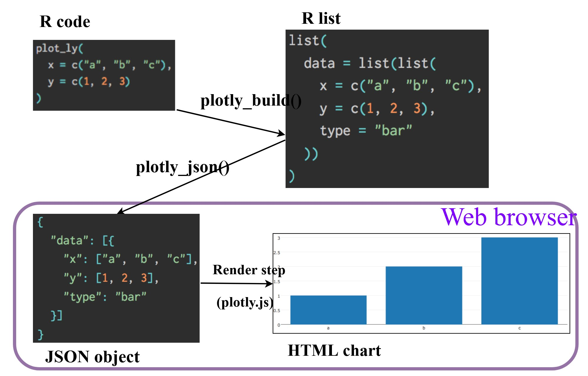

# 3 Programming Interactive Data Visualisation with R

## 3.1 Learning Outcome

This hands-on exercise demonstrates how to create interactive data visualisation by using functions provided by **ggiraph** and **plotlyr** packages.

## 3.2 Getting Started

The code chunk below install and launch the following R packages:

- [**ggiraph**](https://davidgohel.github.io/ggiraph/) for making ‘ggplot’ graphics interactive.

- [**plotly**](https://plotly.com/r/), R library for plotting interactive statistical graphs.

- [**DT**](https://rstudio.github.io/DT/) provides an R interface to the JavaScript library [DataTables](https://datatables.net/) that create interactive table on html page.

- [**tidyverse**](https://www.tidyverse.org/), a family of modern R packages specially designed to support data science, analysis and communication task including creating static statistical graphs.

- [**patchwork**](https://patchwork.data-imaginist.com/) for combining multiple ggplot2 graphs into one figure.

```{r}
pacman::p_load(ggiraph, plotly, 
               patchwork, DT, tidyverse) 
```

## 3.3 Importing Data

The code chunk below import Exam_data.csv data file into R and save it as an tibble data frame called exam_data:

```{r}
exam_data <- read_csv("data/Exam_data.csv")
```

## 3.4 Interactive Data Visualisation - ggiraph methods

ggiraph is an htmlwidget and a ggplot2 extension. It allows ggplot graphics to be interactive.

Interactive is made with [**ggplot geometries**](https://davidgohel.github.io/ggiraph/reference/index.html#section-interactive-geometries) that can understand three arguments:

- **Tooltip**: a column of data-sets that contain tooltips to be displayed when the mouse is over elements.

- **Onclick**: a column of data-sets that contain a JavaScript function to be executed when elements are clicked.

- **Data_id**: a column of data-sets that contain an id to be associated with elements.

If it used within a shiny application, elements associated with an id (data_id) can be selected and manipulated on client and server sides. Refer to this [article](https://www.ardata.fr/ggiraph-book/selections.html) for more detail explanation.

### 3.4.1 Tooltip effect with tooltip aesthetic

Following code chunk plots an interactive statistical graph by using **ggiraph** package. The code chunk consists of two parts. First, an ggplot object will be created. Next, [`girafe()`](https://davidgohel.github.io/ggiraph/reference/girafe.html) of **ggiraph** will be used to create an interactive svg object. By hovering the mouse pointer on an data point of interest, the student’s ID will be displayed.

```{r}
p <- ggplot(data=exam_data, 
       aes(x = MATHS)) +
  geom_dotplot_interactive(
    aes(tooltip = ID),
    stackgroups = TRUE, 
    binwidth = 1, 
    method = "histodot") +
  scale_y_continuous(NULL, 
                     breaks = NULL)
girafe(
  ggobj = p,
  width_svg = 6,
  height_svg = 6*0.618
)
```

### 3.4.2 Displaying multiple information on tooltip

Following code chunk demonstrates customizing tooltip contents by including a list of objects, by hovering the mouse pointer on an data point of interest, the student’s ID and Class will be displayed.

```{r}
exam_data$tooltip <- c(paste0(     
  "Name = ", exam_data$ID,         
  "\n Class = ", exam_data$CLASS)) 

p <- ggplot(data=exam_data, 
       aes(x = MATHS)) +
  geom_dotplot_interactive(
    aes(tooltip = exam_data$tooltip), 
    stackgroups = TRUE,
    binwidth = 1,
    method = "histodot") +
  scale_y_continuous(NULL,               
                     breaks = NULL)
girafe(
  ggobj = p,
  width_svg = 8,
  height_svg = 8*0.618
)
```

### 3.4.3 Customising Tooltip style

Code chunk below uses [`opts_tooltip()`](https://davidgohel.github.io/ggiraph/reference/opts_tooltip.html) of **ggiraph** to customize tooltip rendering by add css declarations, the background color of the tooltip is changed to white and font color changed to black.

```{r}
tooltip_css <- "background-color:white; #<<
font-style:bold; color:black;" #<<

p <- ggplot(data=exam_data, 
       aes(x = MATHS)) +
  geom_dotplot_interactive(              
    aes(tooltip = ID),                   
    stackgroups = TRUE,                  
    binwidth = 1,                        
    method = "histodot") +               
  scale_y_continuous(NULL,               
                     breaks = NULL)
girafe(                                  
  ggobj = p,                             
  width_svg = 6,                         
  height_svg = 6*0.618,
  options = list(    #<<
    opts_tooltip(    #<<
      css = tooltip_css)) #<<
)                                        
```

- Refer to [Customizing girafe objects](https://www.ardata.fr/ggiraph-book/customize.html) to learn more about how to customise ggiraph objects.

### 3.4.5 Displaying statistics on tooltip

Code chunk below demonstrates adding a function to compute 90% confident interval of the mean. The derived statistics are then displayed in the tooltip when mouse hover above each bar.

```{r}
tooltip <- function(y, ymax, accuracy = .01) {
  mean <- scales::number(y, accuracy = accuracy)
  sem <- scales::number(ymax - y, accuracy = accuracy)
  paste("Mean maths scores:", mean, "+/-", sem)
}

gg_point <- ggplot(data=exam_data, 
                   aes(x = RACE),
) +
  stat_summary(aes(y = MATHS, 
                   tooltip = after_stat(  
                     tooltip(y, ymax))),  
    fun.data = "mean_se", 
    geom = GeomInteractiveCol,  
    fill = "light blue"
  ) +
  stat_summary(aes(y = MATHS),
    fun.data = mean_se,
    geom = "errorbar", width = 0.2, linewidth = 0.2
  )

girafe(ggobj = gg_point,
       width_svg = 8,
       height_svg = 8*0.618)
```

### 3.4.6 Hover effect with data_id aesthetic

Code chunk below adds the second interactive element (data_id = CLASS), when mouse hovering over or clicking a dot, all other dots belonging to the same `CLASS` will be highlighted.

```{r}
p <- ggplot(data=exam_data, 
       aes(x = MATHS)) +
  geom_dotplot_interactive(           
    aes(data_id = CLASS),             
    stackgroups = TRUE,               
    binwidth = 1,                        
    method = "histodot") +               
  scale_y_continuous(NULL,               
                     breaks = NULL)
girafe(                                  
  ggobj = p,                             
  width_svg = 6,                         
  height_svg = 6*0.618,
  options = list(
    opts_hover(css = "fill:red;stroke:black;cursor:pointer;")
  )
)                                        
```

Note that the default value of the hover css is *hover_css = “fill:orange;”*.

### 3.4.7 Styling hover effect

In the code chunk below, css codes are used to change the highlighting effect.

```{r}
p <- ggplot(data=exam_data, 
       aes(x = MATHS)) +
  geom_dotplot_interactive(              
    aes(data_id = CLASS),              
    stackgroups = TRUE,                  
    binwidth = 1,                        
    method = "histodot") +               
  scale_y_continuous(NULL,               
                     breaks = NULL)
girafe(                                  
  ggobj = p,                             
  width_svg = 6,                         
  height_svg = 6*0.618,
  options = list(                        
    opts_hover(css = "fill: #202020;"),  
    opts_hover_inv(css = "opacity:0.2;") 
  )                                        
)  
```

### 3.4.8 Combining tooltip and hover effect

Following code chunk combines tooltip and hover effect on the interactive statistical graph, student with same data_id (CLASS) will be highlighted upon mouse over. At the same time, the tooltip will show the CLASS.

```{r}
p <- ggplot(data=exam_data, 
       aes(x = MATHS)) +
  geom_dotplot_interactive(              
    aes(tooltip = CLASS, 
        data_id = CLASS),              
    stackgroups = TRUE,                  
    binwidth = 1,                        
    method = "histodot") +               
  scale_y_continuous(NULL,               
                     breaks = NULL)
girafe(                                  
  ggobj = p,                             
  width_svg = 6,                         
  height_svg = 6*0.618,
  options = list(                        
    opts_hover(css = "fill: #202020;"),  
    opts_hover_inv(css = "opacity:0.2;") 
  )                                        
)    
```

### 3.4.9 Click effect with onclick

`onclick` argument of ggiraph provides hotlink interactivity on the web, as demonstrated by the following code chunk, web document link with a data object will be displayed on the web browser upon mouse click.

```{r}
exam_data$onclick <- sprintf("window.open(\"%s%s\")",
"https://www.moe.gov.sg/schoolfinder?journey=Primary%20school",
as.character(exam_data$ID))

p <- ggplot(data=exam_data, 
       aes(x = MATHS)) +
  geom_dotplot_interactive(              
    aes(onclick = onclick),              
    stackgroups = TRUE,                  
    binwidth = 1,                        
    method = "histodot") +               
  scale_y_continuous(NULL,               
                     breaks = NULL)
girafe(                                  
  ggobj = p,                             
  width_svg = 6,                         
  height_svg = 6*0.618)                                        
```

WARNING: Note that click actions must be a string column in the dataset containing valid javascript instructions.

### 3.4.10 Coordinated Multiple Views with ggiraph

Coordinated multiple views methods has been implemented in the data visualisation below.

```{r}
p1 <- ggplot(data=exam_data, 
       aes(x = MATHS)) +
  geom_dotplot_interactive(              
    aes(data_id = ID),              
    stackgroups = TRUE,                  
    binwidth = 1,                        
    method = "histodot") +  
  coord_cartesian(xlim=c(0,100)) + 
  scale_y_continuous(NULL,               
                     breaks = NULL)

p2 <- ggplot(data=exam_data, 
       aes(x = ENGLISH)) +
  geom_dotplot_interactive(              
    aes(data_id = ID),              
    stackgroups = TRUE,                  
    binwidth = 1,                        
    method = "histodot") + 
  coord_cartesian(xlim=c(0,100)) + 
  scale_y_continuous(NULL,               
                     breaks = NULL)

girafe(code = print(p1 + p2), 
       width_svg = 6,
       height_svg = 3,
       options = list(
         opts_hover(css = "fill: #202020;"),
         opts_hover_inv(css = "opacity:0.2;")
         )
       ) 
```

When a data point of one of the dotplot is selected, the corresponding data point ID on the second data visualisation will be highlighted too.

In order to build a coordinated multiple views as shown in the example above, the following programming strategy will be used:

1.  Appropriate interactive functions of **ggiraph** will be used to create the multiple views.

2.  *patchwork* function of [patchwork](https://patchwork.data-imaginist.com/) package will be used inside girafe function to create the interactive coordinated multiple views.

The *data_id* aesthetic is critical to link observations between plots and the tooltip aesthetic is optional but nice to have when mouse over a point.

## 3.5 Interactive Data Visualisation - plotly methods!

Plotly’s R graphing library create interactive web graphics from **ggplot2** graphs and/or a custom interface to the (MIT-licensed) JavaScript library [**plotly.js**](https://plotly.com/javascript/) inspired by the grammar of graphics. Different from other plotly platform, plot.R is free and open source.



There are two ways to create interactive graph by using plotly, they are:

- by using *plot_ly()*, and

- by using *ggplotly()*

### 3.5.1 Creating an interactive scatter plot: plot_ly() method

The tabset below shows an example a basic interactive plot created by using *plot_ly()*.

::: panel-tabset
## The Plot

```{r}
#| echo: false
plot_ly(data = exam_data, 
             x = ~MATHS, 
             y = ~ENGLISH)
```

## The Code

```{r}
#| eval: false
plot_ly(data = exam_data, 
             x = ~MATHS, 
             y = ~ENGLISH)
```
:::

### 3.5.2 Working with visual variable: plot_ly() method

The code chunk below maps *color* argument to a qualitative visual variable (i.e. RACE).

::: panel-tabset
## The Plot

```{r}
#| echo: false
plot_ly(data = exam_data, 
        x = ~ENGLISH, 
        y = ~MATHS, 
        color = ~RACE)
```

## The Code

```{r}
#| eval: false
plot_ly(data = exam_data, 
        x = ~ENGLISH, 
        y = ~MATHS, 
        color = ~RACE)
```
:::

### 3.5.3 Creating an interactive scatter plot: ggplotly() method

The code chunk below plots an interactive scatter plot by using *ggplotly()*.

::: panel-tabset
## The Plot

```{r}
#| echo: false
p <- ggplot(data=exam_data, 
            aes(x = MATHS,
                y = ENGLISH)) +
  geom_point(size=1) +
  coord_cartesian(xlim=c(0,100),
                  ylim=c(0,100))
ggplotly(p)
```

## The Code

```{r}
#| eval: false
p <- ggplot(data=exam_data, 
            aes(x = MATHS,
                y = ENGLISH)) +
  geom_point(size=1) +
  coord_cartesian(xlim=c(0,100),
                  ylim=c(0,100))
ggplotly(p)
```
:::

### 3.5.4 Coordinated Multiple Views with plotly

The creation of a coordinated linked plot by using plotly involves three steps:

- [`highlight_key()`](https://www.rdocumentation.org/packages/plotly/versions/4.9.2/topics/highlight_key) of **plotly** package is used as shared data.

- two scatterplots will be created by using ggplot2 functions.

- lastly, [*subplot()*](https://plotly.com/r/subplots/) of **plotly** package is used to place them next to each other side-by-side.

::: panel-tabset
## The Plot

```{r}
#| echo: false
d <- highlight_key(exam_data)
p1 <- ggplot(data=d, 
            aes(x = MATHS,
                y = ENGLISH)) +
  geom_point(size=1) +
  coord_cartesian(xlim=c(0,100),
                  ylim=c(0,100))

p2 <- ggplot(data=d, 
            aes(x = MATHS,
                y = SCIENCE)) +
  geom_point(size=1) +
  coord_cartesian(xlim=c(0,100),
                  ylim=c(0,100))
subplot(
  ggplotly(p1),
  ggplotly(p2)
) %>%
  layout(
    annotations = list(
      x = 0.5,
      y = -0.25,
      text = "Click on a data point to see linked selection across plots.",
      showarrow = FALSE,
      xref = "paper",
      yref = "paper",
      xanchor = "center"
    ),
    margin = list(b = 100) 
  )
```

## The Code

```{r}
#| eval: false
d <- highlight_key(exam_data)
p1 <- ggplot(data=d, 
            aes(x = MATHS,
                y = ENGLISH)) +
  geom_point(size=1) +
  coord_cartesian(xlim=c(0,100),
                  ylim=c(0,100))

p2 <- ggplot(data=d, 
            aes(x = MATHS,
                y = SCIENCE)) +
  geom_point(size=1) +
  coord_cartesian(xlim=c(0,100),
                  ylim=c(0,100))
subplot(ggplotly(p1),
        ggplotly(p2))
```
:::

Key knowledge:

- `highlight_key()` simply creates an object of class [crosstalk::SharedData](https://rdrr.io/cran/crosstalk/man/SharedData.html).

- Visit this [link](https://rstudio.github.io/crosstalk/) to learn more about crosstalk

## 3.6 Interactive Data Visualisation - crosstalk methods!

[Crosstalk](https://rstudio.github.io/crosstalk/index.html) is an add-on to the htmlwidgets package. It extends htmlwidgets with a set of classes, functions, and conventions for implementing cross-widget interactions (currently, linked brushing and filtering).

### 3.6.1 Interactive Data Table: DT package

- A wrapper of the JavaScript Library [DataTables](https://datatables.net/)

- Data objects in R can be rendered as HTML tables using the JavaScript library ‘DataTables’ (typically via R Markdown or Shiny).

```{r}
DT::datatable(exam_data, class= "compact")
```

### 3.6.2 Linked brushing: crosstalk method

::: panel-tabset
## The Plot

```{r}
#| echo: false

d <- highlight_key(exam_data) 
p <- ggplot(d, 
            aes(ENGLISH, 
                MATHS)) + 
  geom_point(size=1) +
  coord_cartesian(xlim=c(0,100),
                  ylim=c(0,100))

gg <- highlight(ggplotly(p),        
                "plotly_selected")  

crosstalk::bscols(gg,               
                  DT::datatable(d), 
                  widths = 5)        
```

## The Code

Code chunk below is used to implement the coordinated brushing shown above.

```{r}
#| eval: false

d <- highlight_key(exam_data) 
p <- ggplot(d, 
            aes(ENGLISH, 
                MATHS)) + 
  geom_point(size=1) +
  coord_cartesian(xlim=c(0,100),
                  ylim=c(0,100))

gg <- highlight(ggplotly(p),        
                "plotly_selected")  

crosstalk::bscols(gg,               
                  DT::datatable(d), 
                  widths = 5)        
```
:::

Things to learn from the code chunk:

- *highlight()* is a function of **plotly** package. It sets a variety of options for brushing (i.e., highlighting) multiple plots.

- *bscols()* is a helper function of **crosstalk** package. It makes it easy to put HTML elements side by side. It can be called directly from the console but is especially designed to work in an R Markdown document. **Warning:** This will bring in all of Bootstrap!.

## 3.7 Reference

### 3.7.1 ggiraph

This [link](https://davidgohel.github.io/ggiraph/index.html) provides online version of the reference guide and several useful articles. Use this [link](https://cran.r-project.org/web/packages/ggiraph/ggiraph.pdf) to download the pdf version of the reference guide.

- [How to Plot With Ggiraph](https://www.r-bloggers.com/2018/04/how-to-plot-with-ggiraph/)

- [Interactive map of France with ggiraph](http://rstudio-pubs-static.s3.amazonaws.com/152833_56a4917734204de7b37881d164cf8051.html)

- [Custom interactive sunbursts with ggplot in R](https://www.pipinghotdata.com/posts/2021-06-01-custom-interactive-sunbursts-with-ggplot-in-r/)

- This [link](https://github.com/d-qn/2016_08_02_rioOlympicsAthletes) provides code example on how ggiraph is used to interactive graphs for [Swiss Olympians - the solo specialists](https://www.swissinfo.ch/eng/rio-2016-_swiss-olympiansthe-solo-specialists-/42349156?utm_content=bufferd148b&utm_medium=social&utm_source=twitter.com&utm_campaign=buffer).

### 3.7.2 plotly for R

- [Getting Started with Plotly in R](https://plotly.com/r/getting-started/)

- A collection of plotly R graphs are available via this [link](https://plotly.com/r/).

- Carson Sievert (2020) **Interactive web-based data visualization with R, plotly, and shiny**, Chapman and Hall/CRC is the best resource to learn plotly for R. The online version is available via this [link](https://plotly-r.com/)

- [Plotly R Figure Reference](https://plotly.com/r/reference/index/) provides a comprehensive discussion of each visual representations.

- [Plotly R Library Fundamentals](https://plotly.com/r/plotly-fundamentals/) is a good place to learn the fundamental features of Plotly’s R API.

- [Getting Started](https://gganimate.com/articles/gganimate.html)

- Visit this [link](https://rpubs.com/raymondteo/dataviz8) for a very interesting implementation of gganimate by your senior.

- [Building an animation step-by-step with gganimate](https://www.alexcookson.com/post/2020-10-18-building-an-animation-step-by-step-with-gganimate/).

- [Creating a composite gif with multiple gganimate panels](https://solarchemist.se/2021/08/02/composite-gif-gganimate/)
