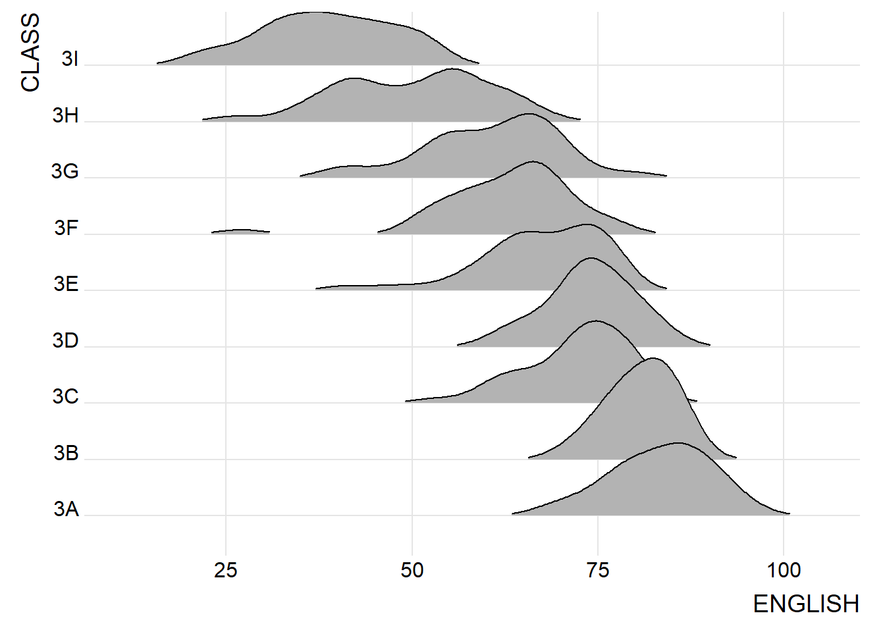

# 5  Visualising Distribution

## 5.1 Learning Outcome

This chapter introduces two relatively new statistical graphic methods for visualising distribution: ridgeline plot and raincloud plot by using ggplot2 and its extensions.

## 5.2 Preparation

### 5.2.1 Installing and loading the packages

The code chunk below will load following R packages into RStudio environment:

-   ggridges, a ggplot2 extension specially designed for plotting ridgeline plots,

-   ggdist, a ggplot2 extension spacially desgin for visualising distribution and uncertainty,

-   tidyverse, a family of R packages to meet the modern data science and visual communication needs,

-   ggthemes, a ggplot extension that provides the user additional themes, scales, and geoms for the ggplots package, and

-   colorspace, an R package provides a broad toolbox for selecting individual colors or color palettes, manipulating these colors, and employing them in various kinds of visualisations.

```{r}
pacman::p_load(ggdist, ggridges, ggthemes,
               colorspace, tidyverse)
```

### 5.2.2 Data import

Code chunk below uses [`read_csv()`](https://readr.tidyverse.org/reference/read_delim.html) of [**readr**](https://readr.tidyverse.org/) package to import *Exam_data.csv* into R and saved it into a tibble data.frame.

```{r}
exam <- read_csv("data/Exam_data.csv")
```

## 5.3 Visualising Distribution with Ridgeline Plot

[*Ridgeline plot*](https://www.data-to-viz.com/graph/ridgeline.html) (sometimes called *Joyplot*) is a data visualisation technique for revealing the distribution of a numeric value for several groups. Distribution can be represented using histograms or density plots, all aligned to the same horizontal scale and presented with a slight overlap.

Figure below is a ridgelines plot showing the distribution of English score by class.



-   Ridgeline plots make sense when the number of group to represent is medium to high, and thus a classic window separation would take to much space. Indeed, the fact that groups overlap each other allows to use space more efficiently. If you have less than 5 groups, dealing with other distribution plots is probably better.

-   It works well when there is a clear pattern in the result, like if there is an obvious ranking in groups. Otherwise group will tend to overlap each other, leading to a messy plot not providing any insight.

### 5.3.1 Plotting ridgeline graph: ggridges method

This section demonstrates how to plot ridgeline plot by using [ggridges](https://wilkelab.org/ggridges/index.html) package.

ggridges package provides two main geom to plot gridgeline plots, they are:  [`geom_ridgeline()`](https://wilkelab.org/ggridges/reference/geom_ridgeline.html) and [`geom_density_ridges()`](https://wilkelab.org/ggridges/reference/geom_density_ridges.html). The former takes height values directly to draw the ridgelines, and the latter first estimates data densities and then draws those using ridgelines.

The ridgeline plot below is plotted by using `geom_density_ridges()`.

::: panel-tabset
#### The Plot

```{r}
#| echo: false
ggplot(exam, 
       aes(x = ENGLISH, 
           y = CLASS)) +
  geom_density_ridges(
    scale = 3,
    rel_min_height = 0.01,
    bandwidth = 3.4,
    fill = lighten("#7097BB", .3),
    color = "white"
  ) +
  scale_x_continuous(
    name = "English grades",
    expand = c(0, 0)
    ) +
  scale_y_discrete(name = NULL, expand = expansion(add = c(0.2, 2.6))) +
  theme_ridges()
```

#### The Code

```{r}
#| eval: false
ggplot(exam, 
       aes(x = ENGLISH, 
           y = CLASS)) +
  geom_density_ridges(
    scale = 3,
    rel_min_height = 0.01,
    bandwidth = 3.4,
    fill = lighten("#7097BB", .3),
    color = "white"
  ) +
  scale_x_continuous(
    name = "English grades",
    expand = c(0, 0)
    ) +
  scale_y_discrete(name = NULL, expand = expansion(add = c(0.2, 2.6))) +
  theme_ridges()
```
:::

### 5.3.2 Varying fill colors along the x axis

Effect of gradient color can be achieved by using either [`geom_ridgeline_gradient()`](https://wilkelab.org/ggridges/reference/geom_ridgeline_gradient.html) or [`geom_density_ridges_gradient()`](https://wilkelab.org/ggridges/reference/geom_ridgeline_gradient.html). Both geoms work just like `geom_ridgeline()` and `geom_density_ridges()`, except that they allow for varying fill colors. However, they do not allow for alpha transparency in the fill. For technical reasons, we can have changing fill colors or transparency but not both.

::: panel-tabset
#### The Plot

```{r}
#| echo: false
ggplot(exam, 
       aes(x = ENGLISH, 
           y = CLASS,
           fill = after_stat(x))) +
  geom_density_ridges_gradient(
    scale = 3,
    rel_min_height = 0.01) +
  scale_fill_viridis_c(name = "Temp. [F]",
                       option = "C") +
  scale_x_continuous(
    name = "English grades",
    expand = c(0, 0)
  ) +
  scale_y_discrete(name = NULL, expand = expansion(add = c(0.2, 2.6))) +
  theme_ridges()
```

#### The Code

```{r}
#| eval: false
ggplot(exam, 
       aes(x = ENGLISH, 
           y = CLASS,
           fill = after_stat(x))) +
  geom_density_ridges_gradient(
    scale = 3,
    rel_min_height = 0.01) +
  scale_fill_viridis_c(name = "Temp. [F]",
                       option = "C") +
  scale_x_continuous(
    name = "English grades",
    expand = c(0, 0)
  ) +
  scale_y_discrete(name = NULL, expand = expansion(add = c(0.2, 2.6))) +
  theme_ridges()
```
:::

### 5.3.3 Mapping the probabilities directly onto colour

Code chunk below maps the probabilities calculated by using `stat(ecdf)` which represent the empirical cumulative density function for the distribution of English score.

::: panel-tabset
#### The Plot

```{r}
#| echo: false
ggplot(exam,
       aes(x = ENGLISH, 
           y = CLASS, 
           fill = 0.5 - abs(0.5-after_stat(ecdf)))) +
  stat_density_ridges(geom = "density_ridges_gradient", 
                      calc_ecdf = TRUE) +
  scale_fill_viridis_c(name = "Tail probability",
                       direction = -1) +
  theme_ridges()
```

#### The Code

```{r}
#| eval: false
ggplot(exam,
       aes(x = ENGLISH, 
           y = CLASS, 
           fill = 0.5 - abs(0.5-after_stat(ecdf)))) +
  stat_density_ridges(geom = "density_ridges_gradient", 
                      calc_ecdf = TRUE) +
  scale_fill_viridis_c(name = "Tail probability",
                       direction = -1) +
  theme_ridges()
```
:::

### 5.3.4 Ridgeline plots with quantile lines

[`geom_density_ridges_gradient()`](https://wilkelab.org/ggridges/reference/geom_ridgeline_gradient.html), can be used to colour the ridgeline plot by quantile, via the calculated `stat(quantile)` aesthetic as shown in the figure below.

::: panel-tabset
#### The Plot

```{r}
#| echo: false
ggplot(exam,
       aes(x = ENGLISH, 
           y = CLASS, 
           fill = factor(stat(quantile))
           )) +
  stat_density_ridges(
    geom = "density_ridges_gradient",
    calc_ecdf = TRUE, 
    quantiles = 4,
    quantile_lines = TRUE) +
  scale_fill_viridis_d(name = "Quartiles") +
  theme_ridges()
```

#### The Code

```{r}
#| eval: false
ggplot(exam,
       aes(x = ENGLISH, 
           y = CLASS, 
           fill = factor(stat(quantile))
           )) +
  stat_density_ridges(
    geom = "density_ridges_gradient",
    calc_ecdf = TRUE, 
    quantiles = 4,
    quantile_lines = TRUE) +
  scale_fill_viridis_d(name = "Quartiles") +
  theme_ridges()
```
:::

Figure below uses cut points 2.5% and 97.5% tails to colour the ridgeline plot instead of quantiles defined using number.

::: panel-tabset
#### The Plot

```{r}
#| echo: false
ggplot(exam,
       aes(x = ENGLISH, 
           y = CLASS, 
           fill = factor(stat(quantile))
           )) +
  stat_density_ridges(
    geom = "density_ridges_gradient",
    calc_ecdf = TRUE, 
    quantiles = c(0.025, 0.975)
    ) +
  scale_fill_manual(
    name = "Probability",
    values = c("#FF0000A0", "#A0A0A0A0", "#0000FFA0"),
    labels = c("(0, 0.025]", "(0.025, 0.975]", "(0.975, 1]")
  ) +
  theme_ridges()
```

#### The Code

```{r}
#| eval: false
ggplot(exam,
       aes(x = ENGLISH, 
           y = CLASS, 
           fill = factor(stat(quantile))
           )) +
  stat_density_ridges(
    geom = "density_ridges_gradient",
    calc_ecdf = TRUE, 
    quantiles = c(0.025, 0.975)
    ) +
  scale_fill_manual(
    name = "Probability",
    values = c("#FF0000A0", "#A0A0A0A0", "#0000FFA0"),
    labels = c("(0, 0.025]", "(0.025, 0.975]", "(0.975, 1]")
  ) +
  theme_ridges()
```
:::

## 5.4 Visualising Distribution with Raincloud Plot

Raincloud Plot is a data visualisation techniques that produces a half-density to a distribution plot. It gets the name because the density plot is in the shape of a “raincloud”. The raincloud (half-density) plot enhances the traditional box-plot by highlighting multiple modalities (an indicator that groups may exist). The boxplot does not show where densities are clustered, but the raincloud plot does.

This section demonstrates visualising the distribution of English score by race with raincloud plot. It will be created by using functions provided by **ggdist** and ggplot2 packages.

### 5.4.1 Plotting a Half Eye graph

First, plot a Half-Eye graph by using [`stat_halfeye()`](https://mjskay.github.io/ggdist/reference/stat_halfeye.html) of **ggdist** package.

This produces a Half Eye visualization, which is contains a half-density and a slab-interval.

::: panel-tabset
#### The Plot

```{r}
#| echo: false
ggplot(exam, 
       aes(x = RACE, 
           y = ENGLISH)) +
  stat_halfeye(adjust = 0.5,
               justification = -0.2,
               .width = 0,
               point_colour = NA)
```

#### The Code

```{r}
#| eval: false
ggplot(exam, 
       aes(x = RACE, 
           y = ENGLISH)) +
  stat_halfeye(adjust = 0.5,
               justification = -0.2,
               .width = 0,
               point_colour = NA)
```
:::

Knowledge point:

Slab interval was removed by setting .width = 0 and point_colour = NA.

### 5.4.2 Adding the boxplot with geom_boxplot()

Next, add the second geometry layer using [`geom_boxplot()`](https://r4va.netlify.app/chap09) of ggplot2. This produces a narrow boxplot. We reduce the width and adjust the opacity.

::: panel-tabset
#### The Plot

```{r}
#| echo: false
ggplot(exam, 
       aes(x = RACE, 
           y = ENGLISH)) +
  stat_halfeye(adjust = 0.5,
               justification = -0.2,
               .width = 0,
               point_colour = NA) +
  geom_boxplot(width = .20,
               outlier.shape = NA)
```

#### The Code

```{r}
#| eval: false
ggplot(exam, 
       aes(x = RACE, 
           y = ENGLISH)) +
  stat_halfeye(adjust = 0.5,
               justification = -0.2,
               .width = 0,
               point_colour = NA) +
  geom_boxplot(width = .20,
               outlier.shape = NA)
```
:::

### 5.4.3 Adding the Dot Plots with stat_dots()

Next, add the third geometry layer using [`stat_dots()`](https://mjskay.github.io/ggdist/reference/stat_dots.html) of ggdist package. This produces a half-dotplot, which is similar to a histogram that indicates the number of samples (number of dots) in each bin. We select side = “left” to indicate we want it on the left-hand side.

::: panel-tabset
#### The Plot

```{r}
#| echo: false
ggplot(exam, 
       aes(x = RACE, 
           y = ENGLISH)) +
  stat_halfeye(adjust = 0.5,
               justification = -0.2,
               .width = 0,
               point_colour = NA) +
  geom_boxplot(width = .20,
               outlier.shape = NA) +
  stat_dots(side = "left", 
            justification = 1.2, 
            binwidth = .5,
            dotsize = 2)
```

#### The Code

```{r}
#| eval: false
ggplot(exam, 
       aes(x = RACE, 
           y = ENGLISH)) +
  stat_halfeye(adjust = 0.5,
               justification = -0.2,
               .width = 0,
               point_colour = NA) +
  geom_boxplot(width = .20,
               outlier.shape = NA) +
  stat_dots(side = "left", 
            justification = 1.2, 
            binwidth = .5,
            dotsize = 2)
```
:::

### 5.4.4 Finishing touch

Lastly, [`coord_flip()`](https://ggplot2.tidyverse.org/reference/coord_flip.html) of ggplot2 package will be used to flip the raincloud chart horizontally to give it the raincloud appearance. At the same time, `theme_economist()` of ggthemes package is used to give the raincloud chart a professional publishing standard look.

::: panel-tabset
#### The Plot

```{r}
#| echo: false
ggplot(exam, 
       aes(x = RACE, 
           y = ENGLISH)) +
  stat_halfeye(adjust = 0.5,
               justification = -0.2,
               .width = 0,
               point_colour = NA) +
  geom_boxplot(width = .20,
               outlier.shape = NA) +
  stat_dots(side = "left", 
            justification = 1.2, 
            binwidth = .5,
            dotsize = 1.5) +
  coord_flip() +
  theme_economist()
```

#### The Code

```{r}
#| eval: false
ggplot(exam, 
       aes(x = RACE, 
           y = ENGLISH)) +
  stat_halfeye(adjust = 0.5,
               justification = -0.2,
               .width = 0,
               point_colour = NA) +
  geom_boxplot(width = .20,
               outlier.shape = NA) +
  stat_dots(side = "left", 
            justification = 1.2, 
            binwidth = .5,
            dotsize = 1.5) +
  coord_flip() +
  theme_economist()
```
:::

**Reference**

-   [Introducing Ridgeline Plots (formerly Joyplots)](https://blog.revolutionanalytics.com/2017/07/joyplots.html)

-   Claus O. Wilke [Fundamentals of Data Visualization](https://clauswilke.com/dataviz/) especially Chapter [6](https://clauswilke.com/dataviz/visualizing-amounts.html), [7](https://clauswilke.com/dataviz/histograms-density-plots.html), [8](https://clauswilke.com/dataviz/ecdf-qq.html), [9](https://clauswilke.com/dataviz/boxplots-violins.html) and [10](https://clauswilke.com/dataviz/visualizing-proportions.html).

-   Allen M, Poggiali D, Whitaker K et al. [“Raincloud plots: a multi-platform tool for robust data. visualization”](https://wellcomeopenresearch.org/articles/4-63) \[version 2; peer review: 2 approved\]. Welcome Open Res 2021, pp. 4:63.

-   [Dots + interval stats and geoms](https://mjskay.github.io/ggdist/articles/dotsinterval.html)
