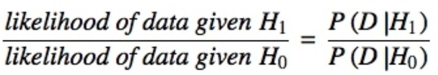
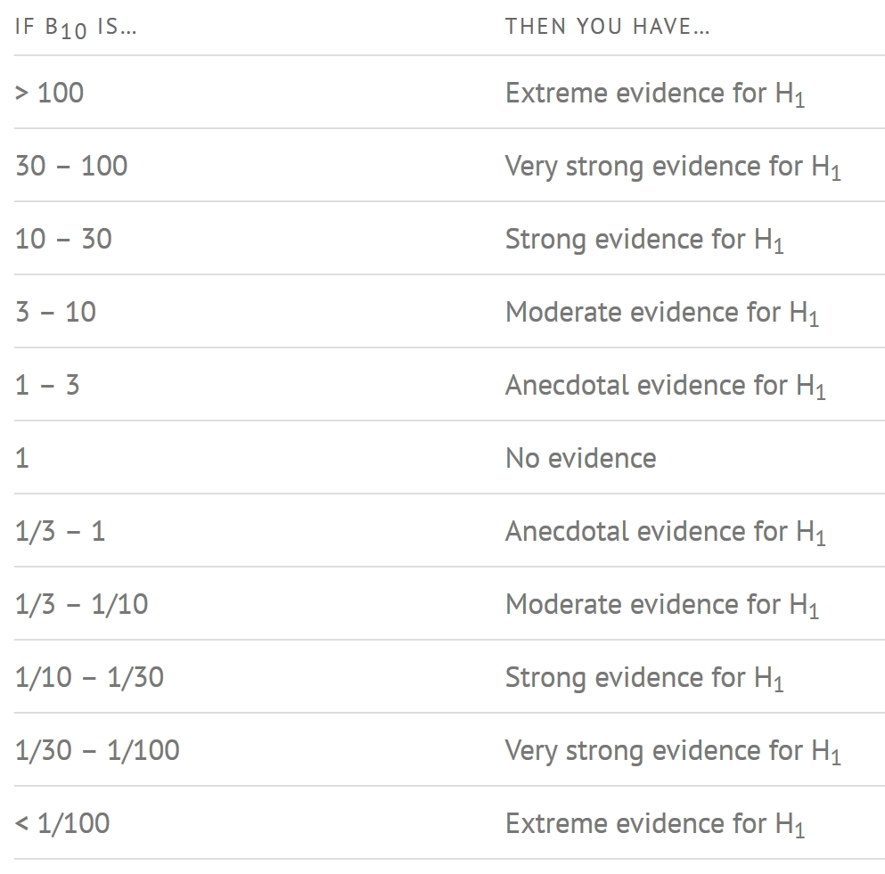
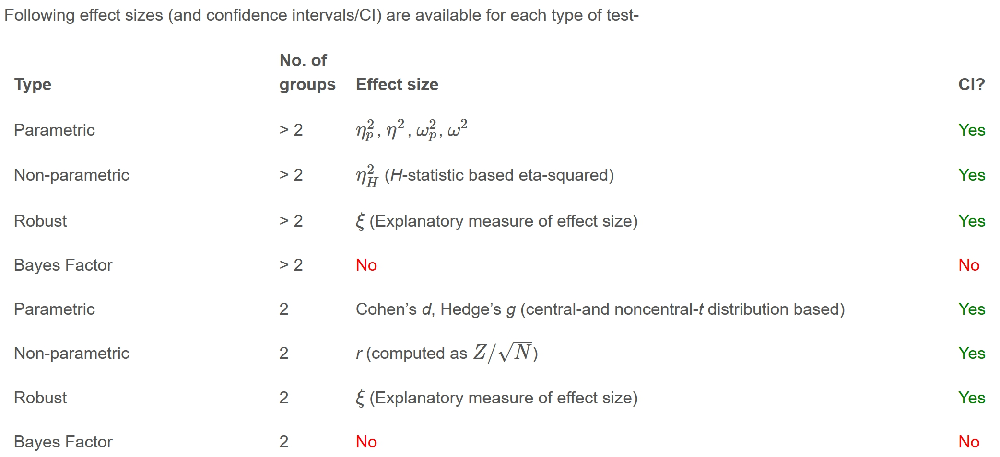
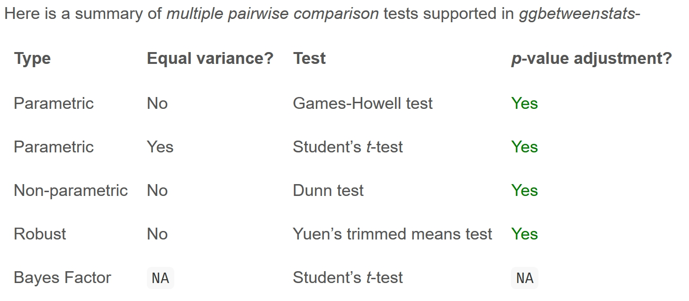

# 6  Visual Statistical Analysis

## 6.1 Learning Outcome

-   ggstatsplot package to create visual graphics with rich statistical information,

-   performance package to visualise model diagnostics, and

-   parameters package to visualise model parameters

## 6.2 Visual Statistical Analysis with ggstatsplot

[**ggstatsplot**](https://indrajeetpatil.github.io/ggstatsplot/index.html) is an extension of [**ggplot2**](https://ggplot2.tidyverse.org/) package for creating graphics with details from statistical tests included in the information-rich plots themselves.

\- To provide alternative statistical inference methods by default. - To follow best practices for statistical reporting.

## 6.3 Preparation

### 6.3.1 Installing and launching R packages

**ggstatsplot** and **tidyverse** will be used for the following sections

```{r}
pacman::p_load(ggstatsplot, tidyverse)
```

### 6.3.2 Importing data

```{r}
exam <- read_csv("data/Exam_data.csv")
```

### 6.3.3 One-sample test: gghistostats() method

In the code chunk below, [*gghistostats()*](https://indrajeetpatil.github.io/ggstatsplot/reference/gghistostats.html) is used to to build an visual of one-sample test on English scores.

```{r}
set.seed(1234)

gghistostats(
  data = exam,
  x = ENGLISH,
  type = "bayes",
  test.value = 60,
  xlab = "English scores"
)
```

Default information: - statistical details - Bayes Factor - sample sizes - distribution summary

### 6.3.4 Unpacking the Bayes Factor

-   A Bayes factor is the ratio of the likelihood of one particular hypothesis to the likelihood of another. It can be interpreted as a measure of the strength of evidence in favor of one theory among two competing theories.

-   That’s because the Bayes factor gives us a way to evaluate the data in favor of a null hypothesis, and to use external information to do so. It tells us what the weight of the evidence is in favor of a given hypothesis.

-   When comparing two hypotheses, H1 (the alternate hypothesis) and H0 (the null hypothesis), the Bayes Factor is often written as B10. It can be defined mathematically as

{fig-align="center" width="411"}

-   The [**Schwarz criterion**](https://www.statisticshowto.com/bayesian-information-criterion/) is one of the easiest ways to calculate rough approximation of the Bayes Factor.

### 6.3.5 How to interpret Bayes Factor

A **Bayes Factor** can be any positive number. Following is one of the most common interpretations:

{width="592"}

### 6.3.6 Two-sample mean test: ggbetweenstats()

In the code chunk below, [*ggbetweenstats()*](https://indrajeetpatil.github.io/ggstatsplot/reference/ggbetweenstats.html) is used to build a visual for two-sample mean test of Maths scores by gender.

```{r}
ggbetweenstats(
  data = exam,
  x = GENDER, 
  y = MATHS,
  type = "np",
  messages = FALSE
)
```

Default information: - statistical details - Bayes Factor - sample sizes - distribution summary

### 6.3.7 Oneway ANOVA Test: ggbetweenstats() method

In the code chunk below, [*ggbetweenstats()*](https://indrajeetpatil.github.io/ggstatsplot/reference/ggbetweenstats.html) is used to build a visual for One-way ANOVA test on English score by race.

```{r}
ggbetweenstats(
  data = exam,
  x = RACE, 
  y = ENGLISH,
  type = "p",
  mean.ci = TRUE, 
  pairwise.comparisons = TRUE, 
  pairwise.display = "s",
  p.adjust.method = "fdr",
  messages = FALSE
)
```

-   “ns” → only non-significant

-   “s” → only significant

-   “all” → everything

#### 6.3.7.1 ggbetweenstats - Summary of tests

](images/clipboard-532339896.png)



### 6.3.8 Significant Test of Correlation: ggscatterstats()

In the code chunk below, [*ggscatterstats()*](https://indrajeetpatil.github.io/ggstatsplot/reference/ggscatterstats.html) is used to build a visual for Significant Test of Correlation between Maths scores and English scores.

```{r}
ggscatterstats(
  data = exam,
  x = MATHS,
  y = ENGLISH,
  marginal = FALSE,
  )
```

### 6.3.9 Significant Test of Association (Depedence) : ggbarstats() methods

In the code chunk below, the Maths scores is binned into a 4-class variable by using [*cut()*](https://www.rdocumentation.org/packages/base/versions/3.6.2/topics/cut).

```{r}
exam1 <- exam %>% 
  mutate(MATHS_bins = 
           cut(MATHS, 
               breaks = c(0,60,75,85,100))
)
```

In this code chunk below [*ggbarstats()*](https://indrajeetpatil.github.io/ggstatsplot/reference/ggbarstats.html) is used to build a visual for Significant Test of Association.

```{r}
ggbarstats(exam1, 
           x = MATHS_bins, 
           y = GENDER)
```
