# **Chapter 14: Modelling, Visualising and Analysing Network Data with R**

## **14.1 Overview**

This hands-on exercise demonstrates how to model, analyse and visualise network data using R.

Learning objectives:

- create graph object data frames, manipulate them using appropriate functions of *dplyr*, *lubridate*, and *tidygraph*,

- build network graph visualisation using appropriate functions of *ggraph*,

- compute network geometrics using *tidygraph*,

- build advanced graph visualisation by incorporating the network geometrics, and

- build interactive network visualisation using *visNetwork* package.

## **14.2 Getting Started**

### **14.2.1 Installing and launching R packages**

Four network data modelling and visualisation packages will be installed and launched. They are igraph, tidygraph, ggraph and visNetwork. Beside these four packages, tidyverse and [lubridate](https://lubridate.tidyverse.org/), an R package specially designed to handle and wrangling time data will be installed and launched too.

The code chunk:


::: {.cell}

```{.r .cell-code}
pacman::p_load(igraph, tidygraph, ggraph, 
               visNetwork, lubridate, clock,
               tidyverse, graphlayouts, 
               concaveman, ggforce)
```
:::


## **14.3 The Data**

The data sets used in this hands-on exercise is from an oil exploration and extraction company. There are two data sets. One contains the nodes data and the other contains the edges (also know as link) data.

### **14.3.1 The edges data**

- *GAStech-email_edges.csv* which consists of two weeks of 9063 emails correspondances between 55 employees.

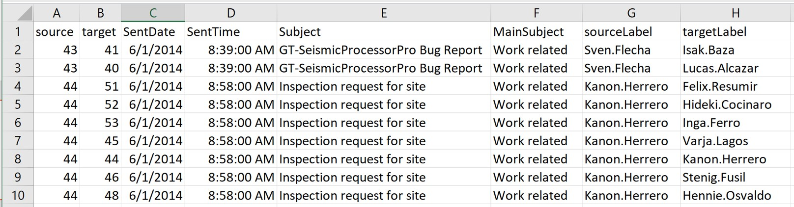

### **14.3.2 The nodes data**

- *GAStech_email_nodes.csv* which consist of the names, department and title of the 55 employees.

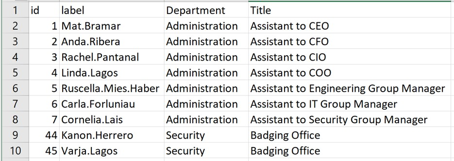

### **14.3.3 Importing network data from files**

This step imports GAStech_email_node.csv and GAStech_email_edges-v2.csv into RStudio environment by using `read_csv()` of **readr** package.


::: {.cell}

```{.r .cell-code}
GAStech_nodes <- read_csv("data/GAStech_email_node.csv")
GAStech_edges <- read_csv("data/GAStech_email_edge-v2.csv")
```
:::


### **14.3.4 Reviewing the imported data**

Next, we will examine the structure of the data frame using *glimpse()* of **dplyr**.


::: {.cell}

```{.r .cell-code}
glimpse(GAStech_edges)
```

::: {.cell-output .cell-output-stdout}

```
Rows: 9,063
Columns: 8
$ source      <dbl> 43, 43, 44, 44, 44, 44, 44, 44, 44, 44, 44, 44, 26, 26, 26…
$ target      <dbl> 41, 40, 51, 52, 53, 45, 44, 46, 48, 49, 47, 54, 27, 28, 29…
$ SentDate    <chr> "6/1/2014", "6/1/2014", "6/1/2014", "6/1/2014", "6/1/2014"…
$ SentTime    <time> 08:39:00, 08:39:00, 08:58:00, 08:58:00, 08:58:00, 08:58:0…
$ Subject     <chr> "GT-SeismicProcessorPro Bug Report", "GT-SeismicProcessorP…
$ MainSubject <chr> "Work related", "Work related", "Work related", "Work rela…
$ sourceLabel <chr> "Sven.Flecha", "Sven.Flecha", "Kanon.Herrero", "Kanon.Herr…
$ targetLabel <chr> "Isak.Baza", "Lucas.Alcazar", "Felix.Resumir", "Hideki.Coc…
```


:::
:::


**Warning**: The output report of GAStech_edges above reveals that the *SentDate* is treated as “Character” data type instead of *date* data type. It is important to change the data type of *SentDate* field back to “Date”” data type.

### **14.3.5 Wrangling time**

The code chunk below will be used to perform the changes.


::: {.cell}

```{.r .cell-code}
GAStech_edges <- GAStech_edges %>%
  mutate(SendDate = dmy(SentDate)) %>%
  mutate(Weekday = wday(SentDate,
                        label = TRUE,
                        abbr = FALSE))
```
:::


**Things to learn from the code chunk above**

- both *dmy()* and *wday()* are functions of **lubridate** package. [lubridate](https://r4va.netlify.app/cran.r-project.org/web/packages/lubridate/vignettes/lubridate.html) is an R package that makes it easier to work with dates and times.

- *dmy()* transforms the SentDate to Date data type.

- *wday()* returns the day of the week as a decimal number or an ordered factor if label is TRUE. The argument abbr is FALSE keep the daya spells in full, i.e. Monday. The function will create a new column in the data.frame i.e. Weekday and the output of *wday()* will save in this newly created field.

- the values in the *Weekday* field are in ordinal scale.

### **14.3.6 Reviewing the revised date fields**

Table below shows the data structure of the reformatted *GAStech_edges* data frame


::: {.cell}
::: {.cell-output .cell-output-stdout}

```
Rows: 9,063
Columns: 10
$ source      <dbl> 43, 43, 44, 44, 44, 44, 44, 44, 44, 44, 44, 44, 26, 26, 26…
$ target      <dbl> 41, 40, 51, 52, 53, 45, 44, 46, 48, 49, 47, 54, 27, 28, 29…
$ SentDate    <chr> "6/1/2014", "6/1/2014", "6/1/2014", "6/1/2014", "6/1/2014"…
$ SentTime    <time> 08:39:00, 08:39:00, 08:58:00, 08:58:00, 08:58:00, 08:58:0…
$ Subject     <chr> "GT-SeismicProcessorPro Bug Report", "GT-SeismicProcessorP…
$ MainSubject <chr> "Work related", "Work related", "Work related", "Work rela…
$ sourceLabel <chr> "Sven.Flecha", "Sven.Flecha", "Kanon.Herrero", "Kanon.Herr…
$ targetLabel <chr> "Isak.Baza", "Lucas.Alcazar", "Felix.Resumir", "Hideki.Coc…
$ SendDate    <date> 2014-01-06, 2014-01-06, 2014-01-06, 2014-01-06, 2014-01-0…
$ Weekday     <ord> Friday, Friday, Friday, Friday, Friday, Friday, Friday, Fr…
```


:::
:::


### **14.3.7 Wrangling attributes**

A close examination of *GAStech_edges* data.frame reveals that it consists of individual e-mail flow records. This is not very useful for visualisation.

In view of this, we will aggregate the individual by date, senders, receivers, main subject and day of the week.

The code chunk:


::: {.cell}

```{.r .cell-code}
GAStech_edges_aggregated <- GAStech_edges %>%
  filter(MainSubject == "Work related") %>%
  group_by(source, target, Weekday) %>%
  summarise(Weight = n()) %>%
  filter(source!=target) %>%
  filter(Weight > 1) %>%
  ungroup()
```
:::


**\
Things to learn from the code chunk above:**

- four functions from **dplyr** package are used. They are: *filter()*, *group()*, *summarise()*, and *ungroup()*.

- The output data.frame is called **GAStech_edges_aggregated**.

- A new field called *Weight* has been added in GAStech_edges_aggregated.

### **14.3.8 Reviewing the revised edges file**

Table below shows the data structure of the reformatted *GAStech_edges* data frame


::: {.cell}
::: {.cell-output .cell-output-stdout}

```
Rows: 9,063
Columns: 10
$ source      <dbl> 43, 43, 44, 44, 44, 44, 44, 44, 44, 44, 44, 44, 26, 26, 26…
$ target      <dbl> 41, 40, 51, 52, 53, 45, 44, 46, 48, 49, 47, 54, 27, 28, 29…
$ SentDate    <chr> "6/1/2014", "6/1/2014", "6/1/2014", "6/1/2014", "6/1/2014"…
$ SentTime    <time> 08:39:00, 08:39:00, 08:58:00, 08:58:00, 08:58:00, 08:58:0…
$ Subject     <chr> "GT-SeismicProcessorPro Bug Report", "GT-SeismicProcessorP…
$ MainSubject <chr> "Work related", "Work related", "Work related", "Work rela…
$ sourceLabel <chr> "Sven.Flecha", "Sven.Flecha", "Kanon.Herrero", "Kanon.Herr…
$ targetLabel <chr> "Isak.Baza", "Lucas.Alcazar", "Felix.Resumir", "Hideki.Coc…
$ SendDate    <date> 2014-01-06, 2014-01-06, 2014-01-06, 2014-01-06, 2014-01-0…
$ Weekday     <ord> Friday, Friday, Friday, Friday, Friday, Friday, Friday, Fr…
```


:::
:::


## **14.4 Creating network objects using tidygraph**

This section, demonstrates how to create a graph data model by using **tidygraph** package. It provides a tidy API for graph/network manipulation. While network data itself is not tidy, it can be envisioned as two tidy tables, one for node data and one for edge data. tidygraph provides a way to switch between the two tables and provides dplyr verbs for manipulating them. Furthermore it provides access to a lot of graph algorithms with return values that facilitate their use in a tidy workflow.

Refer to the following two articles for more details:

- [Introducing tidygraph](https://www.data-imaginist.com/2017/introducing-tidygraph/)

- [tidygraph 1.1 - A tidy hope](https://www.data-imaginist.com/2018/tidygraph-1-1-a-tidy-hope/)

### **14.4.1 The tbl_graph object**

Two functions of **tidygraph** package can be used to create network objects, they are:

- [`tbl_graph()`](https://tidygraph.data-imaginist.com/reference/tbl_graph.html) creates a **tbl_graph** network object from nodes and edges data.

- [`as_tbl_graph()`](https://tidygraph.data-imaginist.com/reference/tbl_graph.html) converts network data and objects to a **tbl_graph** network. Below are network data and objects supported by `as_tbl_graph()`

  - a node data.frame and an edge data.frame,

  - data.frame, list, matrix from base,

  - igraph from igraph,

  - network from network,

  - dendrogram and hclust from stats,

  - Node from data.tree,

  - phylo and evonet from ape, and

  - graphNEL, graphAM, graphBAM from graph (in Bioconductor).

### **14.4.2 The dplyr verbs in tidygraph**

- *activate()* verb from **tidygraph** serves as a switch between tibbles for nodes and edges. All dplyr verbs applied to **tbl_graph** object are applied to the active tibble.

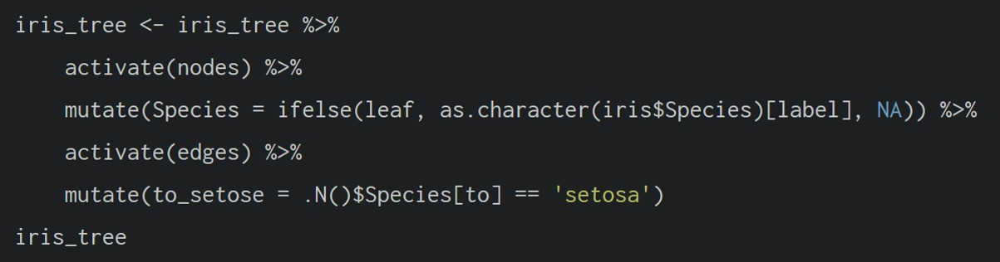

- In the above the *.N()* function is used to gain access to the node data while manipulating the edge data. Similarly *.E()* will give you the edge data and *.G()* will give you the **tbl_graph** object itself.

### **14.4.3 Using `tbl_graph()` to build tidygraph data model.**

In this section, you will use `tbl_graph()` of **tinygraph** package to build an tidygraph’s network graph data.frame.

Refer to reference guide of [`tbl_graph()`](https://tidygraph.data-imaginist.com/reference/tbl_graph.html) for more details.


::: {.cell}

```{.r .cell-code}
GAStech_graph <- tbl_graph(nodes = GAStech_nodes,
                           edges = GAStech_edges_aggregated, 
                           directed = TRUE)
```
:::


### **14.4.4 Reviewing the output tidygraph’s graph object**


::: {.cell}

```{.r .cell-code}
GAStech_graph
```

::: {.cell-output .cell-output-stdout}

```
# A tbl_graph: 54 nodes and 1372 edges
#
# A directed multigraph with 1 component
#
# Node Data: 54 × 4 (active)
      id label               Department     Title                               
   <dbl> <chr>               <chr>          <chr>                               
 1     1 Mat.Bramar          Administration Assistant to CEO                    
 2     2 Anda.Ribera         Administration Assistant to CFO                    
 3     3 Rachel.Pantanal     Administration Assistant to CIO                    
 4     4 Linda.Lagos         Administration Assistant to COO                    
 5     5 Ruscella.Mies.Haber Administration Assistant to Engineering Group Mana…
 6     6 Carla.Forluniau     Administration Assistant to IT Group Manager       
 7     7 Cornelia.Lais       Administration Assistant to Security Group Manager 
 8    44 Kanon.Herrero       Security       Badging Office                      
 9    45 Varja.Lagos         Security       Badging Office                      
10    46 Stenig.Fusil        Security       Building Control                    
# ℹ 44 more rows
#
# Edge Data: 1,372 × 4
   from    to Weekday Weight
  <int> <int> <ord>    <int>
1     1     2 Sunday       5
2     1     2 Monday       2
3     1     2 Tuesday      3
# ℹ 1,369 more rows
```


:::
:::


### **14.4.5 Reviewing the output tidygraph’s graph object**

- The output above reveals that *GAStech_graph* is a tbl_graph object with 54 nodes and 4541 edges.

- The command also prints the first six rows of “Node Data” and the first three of “Edge Data”.

- It states that the Node Data is **active**. The notion of an active tibble within a tbl_graph object makes it possible to manipulate the data in one tibble at a time.

### **14.4.6 Changing the active object**

The nodes tibble data frame is activated by default, but you can change which tibble data frame is active with the *activate()* function. Thus, if we wanted to rearrange the rows in the edges tibble to list those with the highest “weight” first, we could use *activate()* and then *arrange()*.

For example,


::: {.cell}

```{.r .cell-code}
GAStech_graph %>%
  activate(edges) %>%
  arrange(desc(Weight))
```

::: {.cell-output .cell-output-stdout}

```
# A tbl_graph: 54 nodes and 1372 edges
#
# A directed multigraph with 1 component
#
# Edge Data: 1,372 × 4 (active)
    from    to Weekday   Weight
   <int> <int> <ord>      <int>
 1    40    41 Saturday      13
 2    41    43 Monday        11
 3    35    31 Tuesday       10
 4    40    41 Monday        10
 5    40    43 Monday        10
 6    36    32 Sunday         9
 7    40    43 Saturday       9
 8    41    40 Monday         9
 9    19    15 Wednesday      8
10    35    38 Tuesday        8
# ℹ 1,362 more rows
#
# Node Data: 54 × 4
     id label           Department     Title           
  <dbl> <chr>           <chr>          <chr>           
1     1 Mat.Bramar      Administration Assistant to CEO
2     2 Anda.Ribera     Administration Assistant to CFO
3     3 Rachel.Pantanal Administration Assistant to CIO
# ℹ 51 more rows
```


:::
:::


Visit the reference guide of [*activate()*](https://tidygraph.data-imaginist.com/reference/activate.html) to find out more about the function.

## **14.5 Plotting Static Network Graphs with ggraph package**

[**ggraph**](https://ggraph.data-imaginist.com/) is an extension of **ggplot2**, making it easier to carry over basic ggplot skills to the design of network graphs.

As in all network graph, there are three main aspects to a **ggraph**’s network graph, they are:

- [nodes](https://cran.r-project.org/web/packages/ggraph/vignettes/Nodes.html),

- [edges](https://cran.r-project.org/web/packages/ggraph/vignettes/Edges.html) and

- [layouts](https://cran.r-project.org/web/packages/ggraph/vignettes/Layouts.html).

For a comprehensive discussion of each of this aspect of graph, please refer to their respective vignettes provided.

### **14.5.1 Plotting a basic network graph**

The code chunk below uses [*ggraph()*](https://ggraph.data-imaginist.com/reference/ggraph.html), [*geom-edge_link()*](https://ggraph.data-imaginist.com/reference/geom_edge_link.html) and [*geom_node_point()*](https://ggraph.data-imaginist.com/reference/geom_node_point.html) to plot a network graph by using *GAStech_graph*. Before your get started, it is advisable to read their respective reference guide at least once.


::: {.cell}

```{.r .cell-code}
ggraph(GAStech_graph) +
  geom_edge_link() +
  geom_node_point()
```

::: {.cell-output-display}
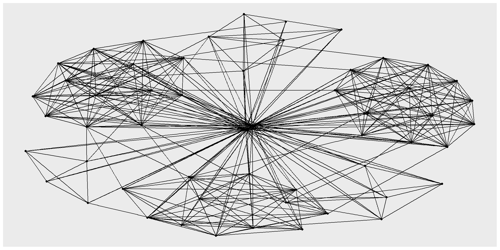{width=1152}
:::
:::


**Things to learn from the code chunk above:**

- The basic plotting function is `ggraph()`, which takes the data to be used for the graph and the type of layout desired. Both of the arguments for `ggraph()` are built around *igraph*. Therefore, `ggraph()` can use either an *igraph* object or a *tbl_graph* object.

### **14.5.2 Changing the default network graph theme**

In this section, you will use [*theme_graph()*](https://ggraph.data-imaginist.com/reference/theme_graph.html) to remove the x and y axes. Before your get started, it is advisable to read it’s reference guide at least once.


::: {.cell}

```{.r .cell-code}
g <- ggraph(GAStech_graph) + 
  geom_edge_link(aes()) +
  geom_node_point(aes())

g + theme_graph()
```

::: {.cell-output-display}
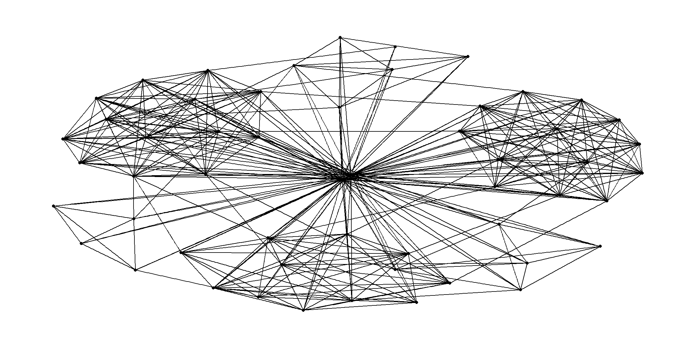{width=1152}
:::
:::


**Things to learn from the code chunk above:**

- **ggraph** introduces a special ggplot theme that provides better defaults for network graphs than the normal ggplot defaults. `theme_graph()`, besides removing axes, grids, and border, changes the font to Arial Narrow (this can be overridden).

- The ggraph theme can be set for a series of plots with the `set_graph_style()` command run before the graphs are plotted or by using `theme_graph()` in the individual plots.

### **14.5.3 Changing the coloring of the plot**

Furthermore, `theme_graph()` makes it easy to change the coloring of the plot.


::: {.cell}

```{.r .cell-code}
g <- ggraph(GAStech_graph) + 
  geom_edge_link(aes(colour = 'grey50')) +
  geom_node_point(aes(colour = 'grey40'))

g + theme_graph(background = 'grey10',
                text_colour = 'white')
```

::: {.cell-output-display}
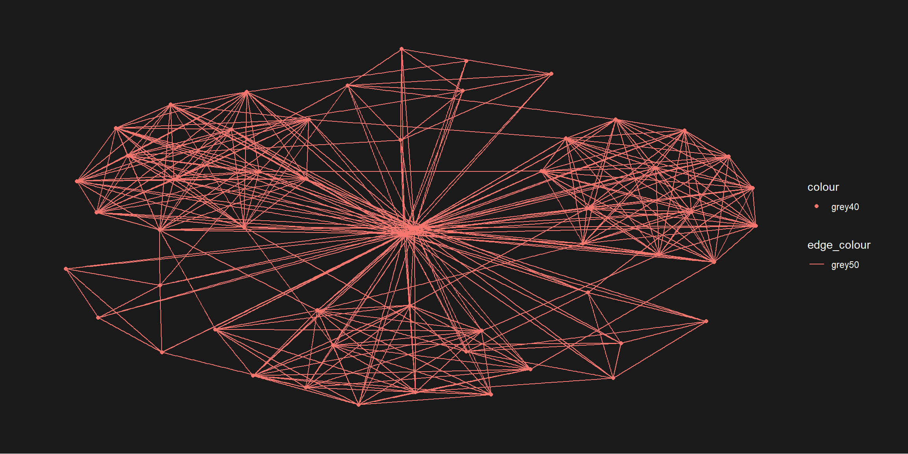{width=1152}
:::
:::


### **14.5.4 Working with ggraph’s layouts**

**ggraph** support many layout for standard used, they are: star, circle, nicely (default), dh, gem, graphopt, grid, mds, spahere, randomly, fr, kk, drl and lgl. Figures below and on the right show layouts supported by `ggraph()`.

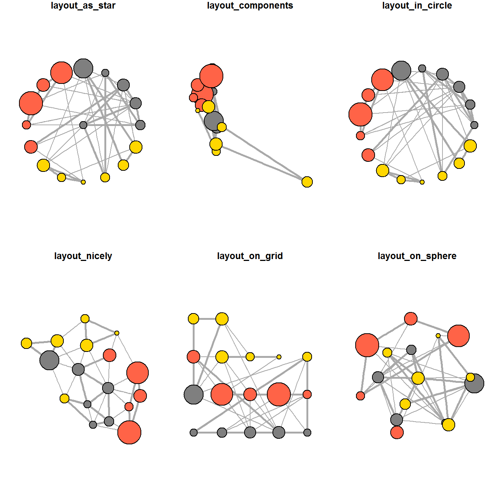

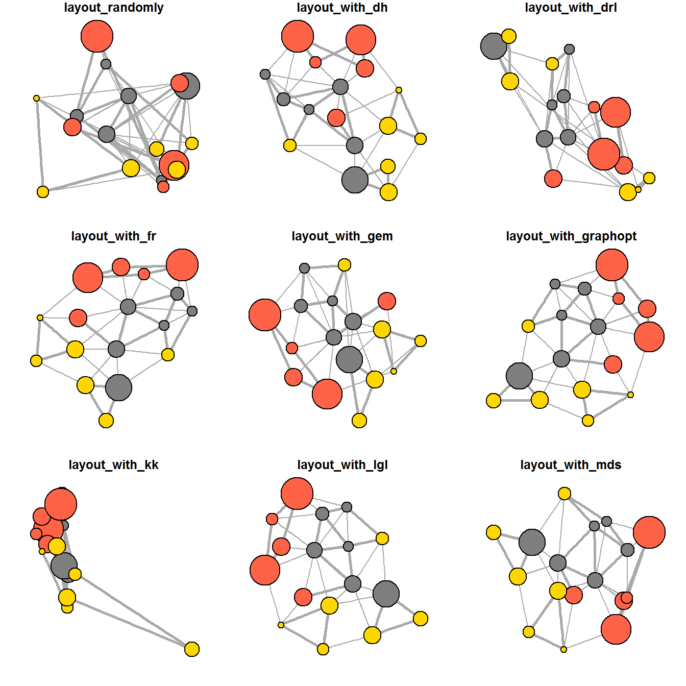

### **14.5.5 Fruchterman and Reingold layout**

The code chunks below will be used to plot the network graph using Fruchterman and Reingold layout.


::: {.cell}

```{.r .cell-code}
g <- ggraph(GAStech_graph, 
            layout = "fr") +
  geom_edge_link(aes()) +
  geom_node_point(aes())

g + theme_graph()
```

::: {.cell-output-display}
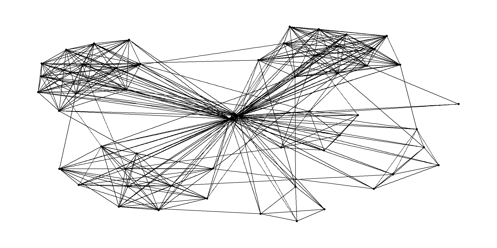{width=1152}
:::
:::


Thing to learn from the code chunk above:

- *layout* argument is used to define the layout to be used.

### **14.5.6 Modifying network nodes**

This section demonstrates adding colour to node by referring to their respective departments.


::: {.cell}

```{.r .cell-code}
g <- ggraph(GAStech_graph, 
            layout = "nicely") + 
  geom_edge_link(aes()) +
  geom_node_point(aes(colour = Department, 
                      size = 3))

g + theme_graph()
```

::: {.cell-output-display}
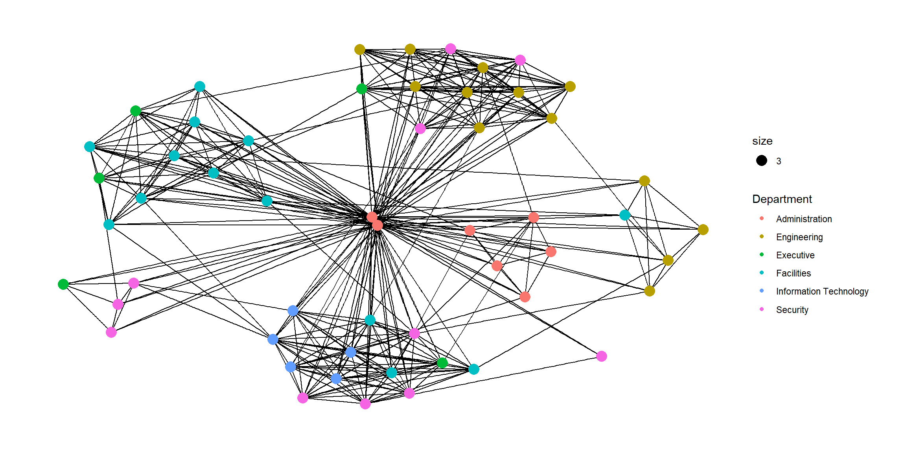{width=1152}
:::
:::


Things to learn from the code chunks above:

- *geom_node_point* is equivalent in functionality to *geo_point* of **ggplot2**. It allows for simple plotting of nodes in different shapes, colours and sizes. In the codes chunks above colour and size are used.

### **14.5.7 Modifying edges**

In the code chunk below, the thickness of the edges will be mapped with the *Weight* variable.


::: {.cell}

```{.r .cell-code}
g <- ggraph(GAStech_graph, 
            layout = "nicely") +
  geom_edge_link(aes(width=Weight), 
                 alpha=0.2) +
  scale_edge_width(range = c(0.1, 5)) +
  geom_node_point(aes(colour = Department), 
                  size = 3)

g + theme_graph()
```

::: {.cell-output-display}
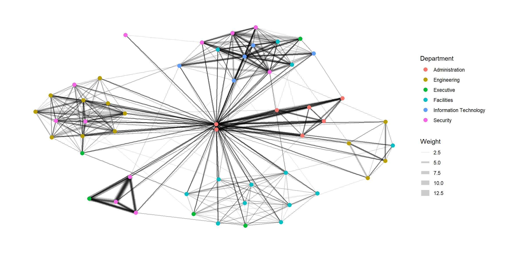{width=1152}
:::
:::


Things to learn from the code chunks above:

- *geom_edge_link* draws edges in the simplest way - as straight lines between the start and end nodes. But, it can do more that that. In the example above, argument *width* is used to map the width of the line in proportional to the Weight attribute and argument alpha is used to introduce opacity on the line.

## **14.6 Creating facet graphs**

Another very useful feature of **ggraph** is faceting. In visualising network data, this technique can be used to reduce edge over-plotting in a very meaningful way by spreading nodes and edges out based on their attributes. This section demonstrates how to use faceting technique to visualise network data.

There are three functions in ggraph to implement faceting, they are:

- [*facet_nodes()*](https://ggraph.data-imaginist.com/reference/facet_nodes.html) whereby edges are only draw in a panel if both terminal nodes are present here,

- [*facet_edges()*](https://ggraph.data-imaginist.com/reference/facet_edges.html) whereby nodes are always drawn in all panels even if the node data contains an attribute named the same as the one used for the edge facetting, and

- [*facet_graph()*](https://ggraph.data-imaginist.com/reference/facet_graph.html) faceting on two variables simultaneously.

### **14.6.1 Working with *facet_edges()***

In the code chunk below, [*facet_edges()*](https://ggraph.data-imaginist.com/reference/facet_edges.html) is used.


::: {.cell}

```{.r .cell-code}
set_graph_style()

g <- ggraph(GAStech_graph, 
            layout = "nicely") + 
  geom_edge_link(aes(width=Weight), 
                 alpha=0.2) +
  scale_edge_width(range = c(0.1, 5)) +
  geom_node_point(aes(colour = Department), 
                  size = 2)

g + facet_edges(~Weekday)
```

::: {.cell-output-display}
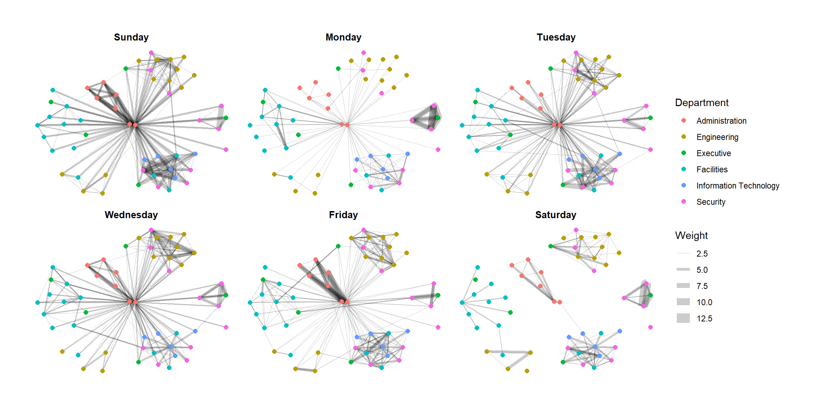{width=1152}
:::
:::


### **14.6.2 Working with *facet_edges()***

The code chunk below uses *theme()* to change the position of the legend.


::: {.cell}

```{.r .cell-code}
set_graph_style()

g <- ggraph(GAStech_graph, 
            layout = "nicely") + 
  geom_edge_link(aes(width=Weight), 
                 alpha=0.2) +
  scale_edge_width(range = c(0.1, 5)) +
  geom_node_point(aes(colour = Department), 
                  size = 2) +
  theme(legend.position = 'bottom')

g + facet_edges(~Weekday)
```

::: {.cell-output-display}
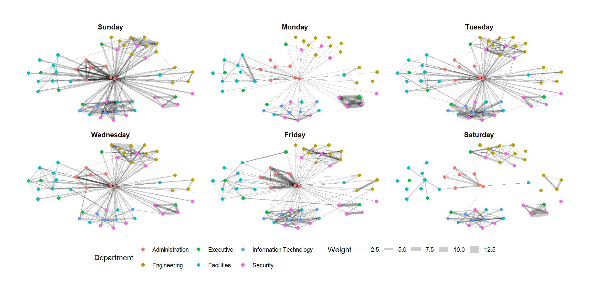{width=1152}
:::
:::


### **14.6.3 A framed facet graph**

The code chunk below adds frame to each graph.


::: {.cell}

```{.r .cell-code}
set_graph_style() 

g <- ggraph(GAStech_graph, 
            layout = "nicely") + 
  geom_edge_link(aes(width=Weight), 
                 alpha=0.2) +
  scale_edge_width(range = c(0.1, 5)) +
  geom_node_point(aes(colour = Department), 
                  size = 2)

g + facet_edges(~Weekday) +
  th_foreground(foreground = "grey80",  
                border = TRUE) +
  theme(legend.position = 'bottom')
```

::: {.cell-output-display}
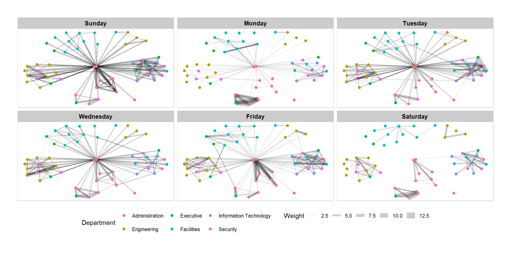{width=1152}
:::
:::


### **14.6.4 Working with *facet_nodes()***

In the code chunkc below, [*facet_nodes()*](https://ggraph.data-imaginist.com/reference/facet_nodes.html) is used.


::: {.cell}

```{.r .cell-code}
set_graph_style()

g <- ggraph(GAStech_graph, 
            layout = "nicely") + 
  geom_edge_link(aes(width=Weight), 
                 alpha=0.2) +
  scale_edge_width(range = c(0.1, 5)) +
  geom_node_point(aes(colour = Department), 
                  size = 2)

g + facet_nodes(~Department)+
  th_foreground(foreground = "grey80",  
                border = TRUE) +
  theme(legend.position = 'bottom')
```

::: {.cell-output-display}
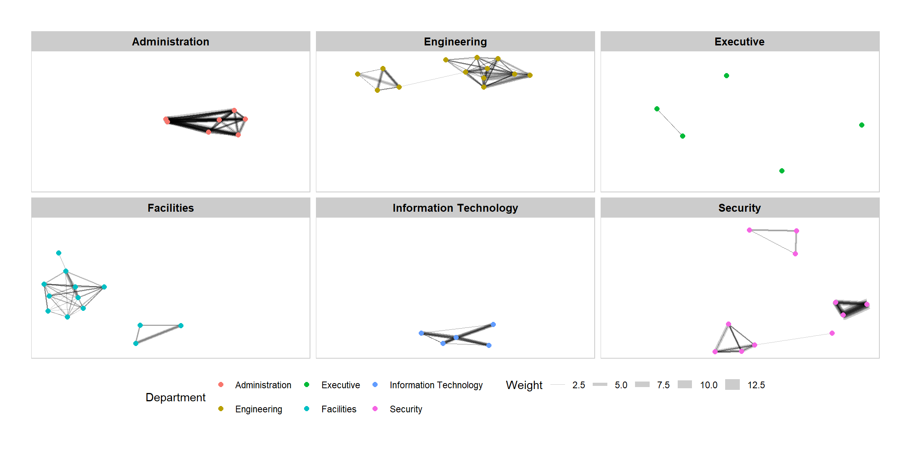{width=1152}
:::
:::


## **14.7 Network Metrics Analysis**

### **14.7.1 Computing centrality indices**

Centrality measures are a collection of statistical indices use to describe the relative important of the actors are to a network. There are four well-known centrality measures, namely: degree, betweenness, closeness and eigenvector.


::: {.cell}

```{.r .cell-code}
g <- GAStech_graph %>%
  mutate(betweenness_centrality = centrality_betweenness()) %>%
  ggraph(layout = "fr") + 
  geom_edge_link(aes(width=Weight), 
                 alpha=0.2) +
  scale_edge_width(range = c(0.1, 5)) +
  geom_node_point(aes(colour = Department,
                      size=betweenness_centrality))
g + theme_graph()
```

::: {.cell-output-display}
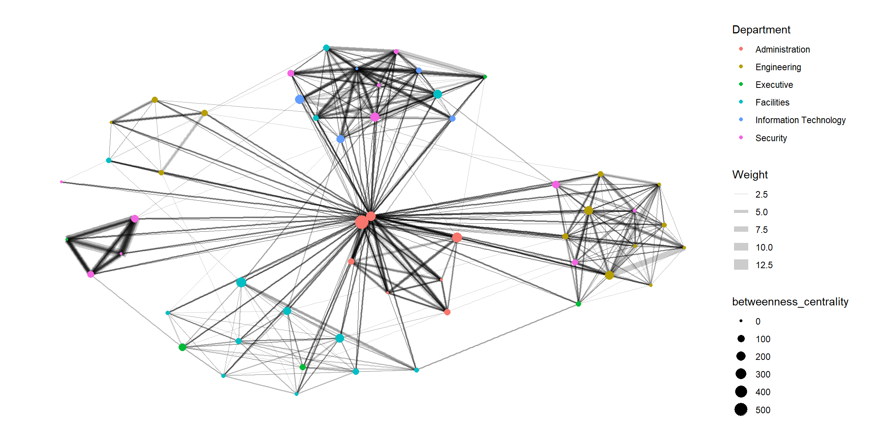{width=1152}
:::
:::


Things to learn from the code chunk above:

- *mutate()* of **dplyr** is used to perform the computation.

- the algorithm used, on the other hand, is the *centrality_betweenness()* of **tidygraph**.

### **14.7.2 Visualising network metrics**

It is important to note that from **ggraph v2.0** onward tidygraph algorithms such as centrality measures can be accessed directly in ggraph calls. This means that it is no longer necessary to precompute and store derived node and edge centrality measures on the graph in order to use them in a plot.


::: {.cell}

```{.r .cell-code}
g <- GAStech_graph %>%
  ggraph(layout = "fr") + 
  geom_edge_link(aes(width=Weight), 
                 alpha=0.2) +
  scale_edge_width(range = c(0.1, 5)) +
  geom_node_point(aes(colour = Department, 
                      size = centrality_betweenness()))
g + theme_graph()
```

::: {.cell-output-display}
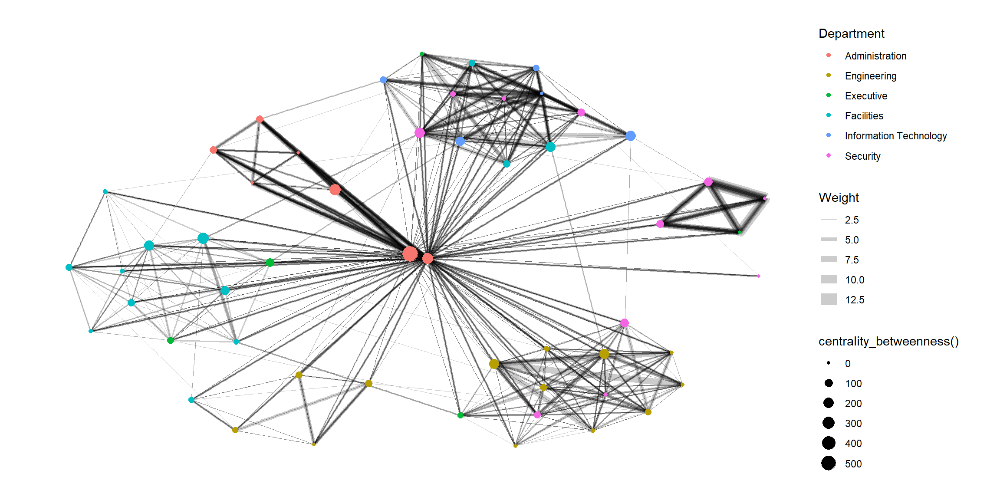{width=1152}
:::
:::


### **14.7.3 Visualising Community**

tidygraph package inherits many of the community detection algorithms imbedded into igraph and makes them available to us, including *Edge-betweenness (group_edge_betweenness)*, *Leading eigenvector (group_leading_eigen)*, *Fast-greedy (group_fast_greedy)*, *Louvain (group_louvain)*, *Walktrap (group_walktrap)*, *Label propagation (group_label_prop)*, *InfoMAP (group_infomap)*, *Spinglass (group_spinglass)*, and *Optimal (group_optimal)*. Some community algorithms are designed to take into account direction or weight, while others ignore it. Use this [link](https://tidygraph.data-imaginist.com/reference/group_graph.html) to find out more about community detection functions provided by tidygraph,

In the code chunk below *group_edge_betweenness()* is used.


::: {.cell}

```{.r .cell-code}
g <- GAStech_graph %>%
  mutate(community = as.factor(
    group_edge_betweenness(
      weights = Weight, 
      directed = TRUE))) %>%
  ggraph(layout = "fr") + 
  geom_edge_link(
    aes(
      width=Weight), 
    alpha=0.2) +
  scale_edge_width(
    range = c(0.1, 5)) +
  geom_node_point(
    aes(colour = community))  

g + theme_graph()
```

::: {.cell-output-display}
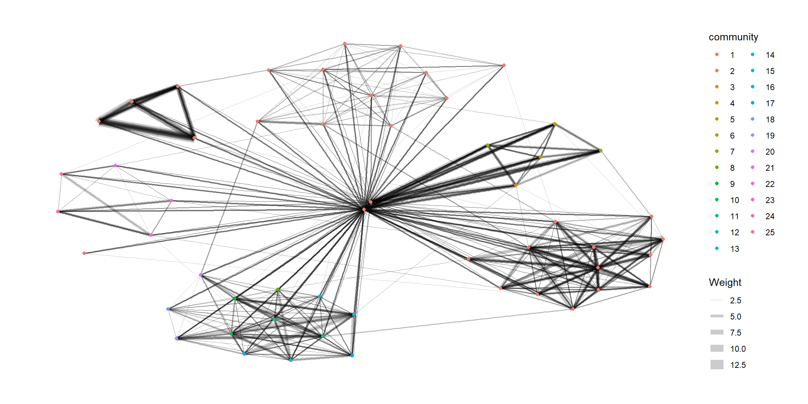{width=1152}
:::
:::


In order to support effective visual investigation, the community network above has been revised by using [`geom_mark_hull()`](https://ggforce.data-imaginist.com/reference/geom_mark_hull.html) of [ggforce](https://ggforce.data-imaginist.com/) package.


::: {.cell}

```{.r .cell-code}
g <- GAStech_graph %>%
  activate(nodes) %>%
  mutate(community = as.factor(
    group_optimal(weights = Weight)),
    betweenness_measure = centrality_betweenness()) %>%
  ggraph(layout = "fr") +
  geom_mark_hull(
    aes(x, y, 
        group = community, 
        fill = community),  
    alpha = 0.2,  
    expand = unit(0.3, "cm"),  # Expand
    radius = unit(0.3, "cm")  # Smoothness
  ) + 
  geom_edge_link(aes(width=Weight), 
                 alpha=0.2) +
  scale_edge_width(range = c(0.1, 5)) +
  geom_node_point(aes(fill = Department,
                      size = betweenness_measure),
                  color = "black",
                  shape = 21)

g + theme_graph()
```

::: {.cell-output-display}
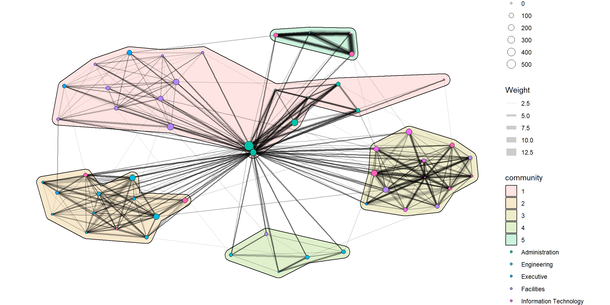{width=1152}
:::
:::


## **14.8 Building Interactive Network Graph with visNetwork**

- [visNetwork()](http://datastorm-open.github.io/visNetwork/) is a R package for network visualization, using [vis.js](http://visjs.org/) javascript library.

- *visNetwork()* function uses a nodes list and edges list to create an interactive graph.

  - The nodes list must include an “id” column, and the edge list must have “from” and “to” columns.

  - The function also plots the labels for the nodes, using the names of the actors from the “label” column in the node list.

- The resulting graph is fun to play around with.

  - You can move the nodes and the graph will use an algorithm to keep the nodes properly spaced.

  - You can also zoom in and out on the plot and move it around to re-center it.

### **14.8.1 Data preparation**

Prepare the data model by using the code chunk below.


::: {.cell}

```{.r .cell-code}
GAStech_edges_aggregated <- GAStech_edges %>%
  left_join(GAStech_nodes, by = c("sourceLabel" = "label")) %>%
  rename(from = id) %>%
  left_join(GAStech_nodes, by = c("targetLabel" = "label")) %>%
  rename(to = id) %>%
  filter(MainSubject == "Work related") %>%
  group_by(from, to) %>%
  summarise(weight = n()) %>%
  filter(from!=to) %>%
  filter(weight > 1) %>%
  ungroup()
```
:::


### **14.8.2 Plotting the first interactive network graph**

The code chunk below will be used to plot an interactive network graph by using the data prepared.


::: {.cell}

```{.r .cell-code}
visNetwork(GAStech_nodes,
           GAStech_edges_aggregated) %>%
  visIgraphLayout(layout = "layout_with_fr") 
```

::: {.cell-output-display}

```{=html}
<div class="visNetwork html-widget html-fill-item" id="htmlwidget-09f716ac1a9a6609983d" style="width:100%;height:325px;"></div>
<script type="application/json" data-for="htmlwidget-09f716ac1a9a6609983d">{"x":{"nodes":{"id":[1,2,3,4,5,6,7,44,45,46,8,9,10,11,12,13,14,15,16,21,26,17,18,19,20,39,40,41,42,43,27,28,29,47,48,49,50,22,51,52,53,54,23,24,25,30,31,32,33,34,35,36,37,38],"label":["Mat.Bramar","Anda.Ribera","Rachel.Pantanal","Linda.Lagos","Ruscella.Mies.Haber","Carla.Forluniau","Cornelia.Lais","Kanon.Herrero","Varja.Lagos","Stenig.Fusil","Marin.Onda","Axel.Calzas","Brand.Tempestad","Elsa.Orilla","Isande.Borrasca","Kare.Orilla","Felix.Balas","Lars.Azada","Lidelse.Dedos","Willem.Vasco-Pais","Bertrand.Ovan","Adra.Nubarron","Birgitta.Frente","Gustav.Cazar","Vira.Frente","Linnea.Bergen","Lucas.Alcazar","Isak.Baza","Nils.Calixto","Sven.Flecha","Emile.Arpa","Varro.Awelon","Dante.Coginian","Edvard.Vann","Hennie.Osvaldo","Isia.Vann","Minke.Mies","Sten.Sanjorge.Jr","Felix.Resumir","Hideki.Cocinaro","Inga.Ferro","Loreto.Bodrogi","Ingrid.Barranco","Ada.Campo-Corrente","Orhan.Strum","Adan.Morlun","Albina.Hafon","Benito.Hawelon","Cecilia.Morluniau","Claudio.Hawelon","Dylan.Scozzese","Henk.Mies","Irene.Nant","Valeria.Morlun"],"Department":["Administration","Administration","Administration","Administration","Administration","Administration","Administration","Security","Security","Security","Engineering","Engineering","Engineering","Engineering","Engineering","Engineering","Engineering","Engineering","Engineering","Executive","Facilities","Engineering","Engineering","Engineering","Engineering","Information Technology","Information Technology","Information Technology","Information Technology","Information Technology","Facilities","Facilities","Facilities","Security","Security","Security","Security","Executive","Security","Security","Security","Security","Executive","Executive","Executive","Facilities","Facilities","Facilities","Facilities","Facilities","Facilities","Facilities","Facilities","Facilities"],"Title":["Assistant to CEO","Assistant to CFO","Assistant to CIO","Assistant to COO","Assistant to Engineering Group Manager","Assistant to IT Group Manager","Assistant to Security Group Manager","Badging Office","Badging Office","Building Control","Drill Site Manager","Drill Technician","Drill Technician","Drill Technician","Drill Technician","Drill Technician","Engineer","Engineer","Engineering Group Manager","Environmental Safety Advisor","Facilities Group Manager","Geologist","Geologist","Hydraulic Technician","Hydraulic Technician","IT Group Manager","IT Helpdesk","IT Technician","IT Technician","IT Technician","Janitor","Janitor","Lead Janitor","Perimeter Control","Perimeter Control","Perimeter Control","Perimeter Control","President/CEO","Security Group Manager","Site Control","Site Control","Site Control","SVP/CFO","SVP/CIO","SVP/COO","Truck Driver","Truck Driver","Truck Driver","Truck Driver","Truck Driver","Truck Driver","Truck Driver","Truck Driver","Truck Driver"],"x":[0.04977611916395208,0.03426957858779156,-0.2536628599926101,-0.2462121225987842,0.08982350355697233,-0.02581221608339845,-0.4372404456109715,-0.8051740939397938,-0.5095539282422665,-0.6449897916278704,0.6254311139183339,0.1579544427121982,0.4625367636447737,0.7730457878548571,0.2452750135762327,0.4574384160168654,0.6201063189360578,0.4369142247813937,0.3830423234949969,-0.8316646923347428,1,0.1715004217339697,0.7729497251084645,0.6459738524846586,0.234429092594572,0.1225952024263708,-0.05038941837679978,-0.9747895044277555,-1,-0.8409023246374551,0.7113450164781916,0.5137742019112852,0.4729082524692396,-0.05971380729904274,0.008285447662973455,-0.6797691717833116,-0.3105653429008214,-0.4661996525919899,-0.2893035942695793,-0.3400848368696857,-0.5109619709296451,-0.5982113190048344,0.03425668690150574,-0.658854232339608,-0.722312007354438,0.948375790104202,0.5093444169191625,0.8444089870294851,0.686550306964975,0.6898085931906963,0.8363788665919827,0.3448685317584756,0.8643267848448883,0.6364537409551634],"y":[-0.01922252818780135,-0.5000342144156688,-0.4892171592607958,-0.7944258357919901,0.04364057933165633,-0.769360814121813,-0.4537227341019758,0.4350647999233943,0.7906994768947575,0.3723356685437087,0.5345683721854124,0.8523964799464872,1,0.5242765225027224,0.7026785940043387,0.7066991865646139,0.772840988968055,0.4723902385159375,0.8773438396982836,-0.427847100904182,-0.3772486800167386,0.1950296454716174,0.7225810418894967,0.9128999369878987,0.9814046128154901,-1,0.02480981746045319,0.190663019664008,-0.01030244663763802,-0.09740802036139262,-0.09355548086636967,-0.5547077672823975,-0.1406301475432693,0.1592669647412444,0.1354939521538592,0.5307948095869908,0.8324311296441562,-0.7314984359414118,0.5893291418063114,0.4146398488894536,0.1840032424969698,0.6670750110527834,-0.08895493916443398,-0.5888376458787243,-0.3113004926254218,-0.2274711711560984,-0.6950294453915823,-0.142903142257001,-0.5160405177737626,-0.6916835890401811,-0.4003247446586061,-0.4497126441994291,-0.5794718128859653,-0.3472208464159791]},"edges":{"from":[1,1,1,1,1,1,1,1,1,1,1,1,1,1,1,1,1,1,1,1,1,1,1,1,1,1,1,1,1,1,1,1,1,1,1,1,1,1,1,1,1,1,1,1,1,1,1,1,1,1,1,1,1,2,2,2,2,2,2,2,2,2,3,3,3,3,3,3,3,4,4,4,4,4,4,5,5,5,5,5,5,5,5,5,5,5,5,5,5,5,5,5,5,5,5,5,5,5,5,5,5,5,5,5,5,5,5,5,5,5,5,5,5,5,5,5,5,5,5,5,5,5,5,5,5,5,5,5,6,6,6,6,6,6,6,7,7,7,7,7,7,8,8,8,8,8,8,8,8,8,8,8,8,8,9,9,9,9,9,9,9,9,9,9,9,9,9,10,10,10,10,10,10,10,10,10,10,10,10,11,11,11,11,11,11,11,11,11,11,11,11,11,12,12,12,12,12,12,12,12,12,12,12,12,12,13,13,13,13,13,13,13,13,13,13,13,13,14,14,14,14,14,14,14,14,14,14,14,14,15,15,15,15,15,15,15,15,15,15,15,15,15,16,16,16,16,16,16,16,16,16,16,16,16,17,17,17,17,17,17,17,17,17,17,17,17,17,17,17,17,17,17,17,17,17,17,17,17,17,17,17,17,17,17,17,17,17,17,17,17,17,17,17,17,17,17,17,17,17,17,17,17,17,17,17,17,17,18,18,18,18,18,18,18,18,18,18,18,19,19,19,19,19,19,19,19,19,19,19,19,20,20,20,20,20,20,20,20,20,20,20,20,20,21,21,21,21,21,22,22,22,22,22,23,23,23,23,23,23,23,23,23,23,23,23,23,23,23,23,23,23,23,23,23,23,23,23,23,23,23,23,23,23,23,23,23,23,23,23,23,23,23,23,23,23,23,23,23,23,23,23,23,23,23,23,23,24,24,24,24,24,25,25,25,25,25,26,26,26,26,26,26,26,26,26,26,26,26,27,27,27,27,27,27,27,27,27,27,27,27,27,28,28,28,28,28,28,28,28,28,28,28,28,28,29,29,29,29,29,29,29,29,29,29,29,29,29,29,29,29,30,30,30,30,30,30,30,30,30,30,30,30,31,31,31,31,31,31,31,31,31,31,31,31,32,32,32,32,32,32,32,32,32,32,32,32,32,33,33,33,33,33,33,33,33,33,33,33,33,33,34,34,34,34,34,34,34,34,34,34,34,35,35,35,35,35,35,35,35,35,35,35,35,36,36,36,36,36,36,36,36,36,36,36,36,36,36,36,37,37,37,37,37,37,37,37,37,37,37,37,38,38,38,38,38,38,38,38,38,39,40,40,40,40,40,40,40,40,40,40,40,40,40,40,40,40,40,40,40,40,40,40,40,40,40,40,40,40,40,40,40,40,40,40,40,40,40,40,40,40,40,40,40,40,40,40,40,40,40,40,40,40,40,41,41,41,42,42,42,42,43,43,43,44,44,44,44,44,44,44,44,44,44,44,45,45,45,45,45,45,45,45,45,45,46,46,46,46,46,46,46,46,46,46,47,47,47,47,47,47,47,47,47,47,47,47,47,47,47,47,47,47,47,47,47,47,47,47,47,47,47,47,47,47,47,47,47,47,47,47,47,47,47,47,47,47,47,47,47,47,47,47,47,47,47,47,47,48,48,48,48,48,48,48,48,48,48,48,48,48,48,48,48,48,48,48,48,48,48,48,48,48,48,48,48,48,48,48,48,48,48,48,48,48,48,48,48,48,48,48,48,48,48,48,48,48,48,48,48,48,49,49,49,49,49,49,49,50,50,50,50,50,50,51,51,51,51,51,51,51,51,51,51,51,52,52,52,52,52,52,52,52,52,52,52,52,53,53,53,53,53,53,53,53,53,53,53,53,54,54,54,54,54,54,54,54,54,54,54],"to":[2,3,4,5,6,7,8,9,10,11,12,13,14,15,16,17,18,19,20,21,22,23,24,25,26,27,28,29,30,31,32,33,34,35,36,37,38,39,40,41,42,43,44,45,46,47,48,49,50,51,52,53,54,1,3,4,5,6,7,15,36,38,1,2,4,5,6,7,48,1,2,3,5,6,7,1,2,3,4,6,7,8,9,10,11,12,13,14,15,16,17,18,19,20,21,22,23,24,25,26,27,28,29,30,31,32,33,34,35,36,37,38,39,40,41,42,43,44,45,46,47,48,49,50,51,52,53,54,1,2,3,4,5,7,28,1,2,3,4,5,6,9,10,11,12,13,14,15,16,17,18,19,20,27,8,10,11,12,13,14,15,16,17,18,19,20,45,8,9,11,12,13,14,15,16,17,18,19,20,8,9,10,12,13,14,15,16,17,18,19,20,32,8,9,10,11,13,14,15,16,17,18,19,20,52,8,9,10,11,12,14,15,16,17,18,19,20,8,9,10,11,12,13,15,16,17,18,19,20,2,8,9,10,11,12,13,14,16,17,18,19,20,8,9,10,11,12,13,14,15,17,18,19,20,1,2,3,4,5,6,7,8,9,10,11,12,13,14,15,16,18,19,20,21,22,23,24,25,26,27,28,29,30,31,32,33,34,35,36,37,38,39,40,41,42,43,44,45,46,47,48,49,50,51,52,53,54,8,9,10,11,12,13,14,15,17,19,20,8,9,10,11,12,13,14,15,16,17,18,20,8,9,10,11,12,13,14,15,16,17,18,19,50,22,23,24,25,53,21,23,24,25,36,1,2,3,4,5,6,7,8,9,10,11,12,13,14,15,16,17,18,19,20,21,22,24,25,26,27,28,29,30,31,32,33,34,35,36,37,38,39,40,41,42,43,44,45,46,47,48,49,50,51,52,53,54,5,21,22,23,25,21,22,23,24,46,27,28,29,30,31,32,33,34,35,36,37,38,8,28,29,30,31,32,33,34,35,36,37,38,40,6,26,27,29,30,31,32,33,34,35,36,37,38,1,26,27,28,30,31,32,33,34,35,36,37,38,40,51,52,26,27,28,29,31,32,33,34,35,36,37,38,3,27,28,29,30,32,33,34,35,36,37,38,11,26,27,28,29,30,31,33,34,35,36,37,38,23,26,27,28,29,30,31,32,34,35,36,37,38,27,28,29,30,31,32,33,35,36,37,38,26,27,28,29,30,31,32,33,34,36,37,38,2,22,26,27,28,29,30,31,32,33,34,35,37,38,53,26,27,28,29,30,31,32,33,34,35,36,38,27,28,29,30,31,32,34,35,36,34,1,2,3,4,5,6,7,8,9,10,11,12,13,14,15,16,17,18,19,20,21,22,23,24,25,26,27,28,29,30,31,32,33,34,35,36,37,38,39,41,42,43,44,45,46,47,48,49,50,51,52,53,54,40,42,43,40,41,43,44,40,41,42,42,45,46,47,48,49,50,51,52,53,54,44,46,47,48,49,50,51,52,53,54,44,45,47,48,49,50,51,52,53,54,1,2,3,4,5,6,7,8,9,10,11,12,13,14,15,16,17,18,19,20,21,22,23,24,25,26,27,28,29,30,31,32,33,34,35,36,37,38,39,40,41,42,43,44,45,46,48,49,50,51,52,53,54,1,2,3,4,5,6,7,8,9,10,11,12,13,14,15,16,17,18,19,20,21,22,23,24,25,26,27,28,29,30,31,32,33,34,35,36,37,38,39,40,41,42,43,44,45,46,47,49,50,51,52,53,54,3,45,46,47,48,52,54,5,20,48,49,53,54,29,44,45,46,47,48,49,50,52,53,54,7,12,29,44,45,46,47,48,49,50,51,53,5,21,36,44,45,47,48,49,50,51,52,54,5,44,45,46,47,48,49,50,51,52,53],"weight":[21,21,21,21,21,21,15,15,15,15,15,15,15,15,15,15,15,15,15,15,15,15,15,15,15,15,15,16,15,15,15,15,15,15,15,15,15,15,15,15,15,15,15,15,15,15,15,15,15,15,15,15,15,6,6,6,6,6,9,2,2,2,8,8,8,8,8,8,2,12,12,12,12,12,12,20,20,20,20,20,20,10,10,10,10,10,10,10,10,10,10,10,10,10,10,10,10,11,10,10,10,10,10,10,10,10,10,10,10,10,10,10,10,10,10,10,10,10,10,10,10,11,11,11,10,10,11,11,11,11,11,11,11,11,3,12,15,12,12,12,12,3,4,3,3,4,4,3,3,4,3,4,3,3,4,4,9,4,7,7,11,5,4,5,6,8,3,8,8,7,9,9,6,9,10,10,7,5,7,11,10,11,6,11,7,11,9,10,7,10,8,3,9,10,8,8,11,6,7,5,3,6,5,6,2,9,5,10,7,7,4,3,4,7,2,3,3,6,5,7,4,6,6,7,5,7,6,3,4,3,6,13,8,8,5,6,6,11,9,6,2,7,6,8,7,5,5,7,6,7,7,5,4,6,2,2,2,2,2,2,2,6,4,7,7,6,6,6,6,5,5,4,4,2,2,2,2,2,2,2,2,2,2,2,2,2,2,2,2,2,2,2,2,2,2,2,2,2,2,2,2,2,2,2,2,2,2,3,3,4,5,3,3,2,5,2,3,2,4,8,5,9,6,5,4,10,7,4,4,5,5,10,5,7,4,5,4,4,4,3,2,4,3,4,2,4,7,2,7,5,10,4,2,4,4,4,4,4,4,4,4,4,4,4,4,6,4,4,4,4,4,4,4,6,10,17,9,4,4,4,4,4,4,4,5,4,4,4,4,4,4,4,4,4,4,4,4,4,4,4,4,4,4,4,4,4,2,5,9,7,3,8,2,3,4,2,26,25,25,25,25,25,24,25,25,26,25,26,3,4,3,6,4,3,3,6,5,3,4,5,3,3,2,3,6,5,8,6,6,7,4,6,6,6,2,2,6,5,7,5,6,5,7,6,6,5,5,3,2,3,3,5,7,9,12,9,9,6,13,12,9,11,2,5,4,6,6,9,7,6,12,7,7,8,4,2,8,6,9,7,10,7,9,6,10,5,8,2,4,2,3,5,7,8,4,7,5,7,6,4,5,6,4,7,8,5,9,6,6,10,6,3,11,7,9,11,15,7,11,11,9,13,13,2,2,3,12,11,12,16,15,19,12,11,14,11,13,3,3,4,5,6,7,7,6,9,10,7,5,3,2,5,5,2,2,2,4,4,3,2,2,2,2,2,2,2,2,2,2,2,2,2,2,2,2,2,2,2,2,2,2,2,2,2,2,2,4,2,3,2,2,2,2,2,2,2,2,2,2,40,22,30,2,2,2,2,2,2,2,2,2,2,2,28,19,24,25,19,28,2,15,16,24,3,4,2,5,6,2,5,5,2,6,3,6,4,2,6,5,5,4,7,5,6,6,3,4,9,5,6,8,7,4,6,2,2,2,2,2,2,2,2,2,2,2,2,2,2,2,2,2,2,2,2,2,2,2,2,2,2,2,2,2,2,2,2,2,2,2,3,2,2,2,2,2,2,2,5,4,3,7,5,6,6,5,5,5,2,2,4,2,4,2,2,2,2,2,2,2,2,3,2,2,2,2,2,2,2,2,2,2,2,2,2,2,2,2,2,2,2,2,2,2,2,2,2,2,2,2,2,4,4,5,3,8,6,5,5,5,6,2,3,2,3,3,4,2,2,4,2,2,5,2,3,3,3,3,4,4,2,3,3,3,3,2,2,4,2,4,4,3,4,5,3,2,4,3,3,4,3,3,2,5,4,8,2,2,5,2,3,4,3,2,5,4,4,2,3,4]},"nodesToDataframe":true,"edgesToDataframe":true,"options":{"width":"100%","height":"100%","nodes":{"shape":"dot","physics":false},"manipulation":{"enabled":false},"edges":{"smooth":false},"physics":{"stabilization":false}},"groups":null,"width":null,"height":null,"idselection":{"enabled":false},"byselection":{"enabled":false},"main":null,"submain":null,"footer":null,"background":"rgba(0, 0, 0, 0)","igraphlayout":{"type":"square"}},"evals":[],"jsHooks":[]}</script>
```

:::
:::


Visit [Igraph](http://datastorm-open.github.io/visNetwork/igraph.html) to find out more about *visIgraphLayout*’s argument.

### **14.8.4 Working with visual attributes - Nodes**

visNetwork() looks for a field called “group” in the nodes object and colour the nodes according to the values of the group field.

The code chunk below rename Department field to group.


::: {.cell}

```{.r .cell-code}
GAStech_nodes <- GAStech_nodes %>%
  rename(group = Department) 
```
:::


When we rerun the code chunk below, visNetwork shades the nodes by assigning unique colour to each category in the *group* field.


::: {.cell}

```{.r .cell-code}
visNetwork(GAStech_nodes,
           GAStech_edges_aggregated) %>%
  visIgraphLayout(layout = "layout_with_fr") %>%
  visLegend() %>%
  visLayout(randomSeed = 123)
```

::: {.cell-output-display}

```{=html}
<div class="visNetwork html-widget html-fill-item" id="htmlwidget-b014187fbb1fab19dd43" style="width:100%;height:325px;"></div>
<script type="application/json" data-for="htmlwidget-b014187fbb1fab19dd43">{"x":{"nodes":{"id":[1,2,3,4,5,6,7,44,45,46,8,9,10,11,12,13,14,15,16,21,26,17,18,19,20,39,40,41,42,43,27,28,29,47,48,49,50,22,51,52,53,54,23,24,25,30,31,32,33,34,35,36,37,38],"label":["Mat.Bramar","Anda.Ribera","Rachel.Pantanal","Linda.Lagos","Ruscella.Mies.Haber","Carla.Forluniau","Cornelia.Lais","Kanon.Herrero","Varja.Lagos","Stenig.Fusil","Marin.Onda","Axel.Calzas","Brand.Tempestad","Elsa.Orilla","Isande.Borrasca","Kare.Orilla","Felix.Balas","Lars.Azada","Lidelse.Dedos","Willem.Vasco-Pais","Bertrand.Ovan","Adra.Nubarron","Birgitta.Frente","Gustav.Cazar","Vira.Frente","Linnea.Bergen","Lucas.Alcazar","Isak.Baza","Nils.Calixto","Sven.Flecha","Emile.Arpa","Varro.Awelon","Dante.Coginian","Edvard.Vann","Hennie.Osvaldo","Isia.Vann","Minke.Mies","Sten.Sanjorge.Jr","Felix.Resumir","Hideki.Cocinaro","Inga.Ferro","Loreto.Bodrogi","Ingrid.Barranco","Ada.Campo-Corrente","Orhan.Strum","Adan.Morlun","Albina.Hafon","Benito.Hawelon","Cecilia.Morluniau","Claudio.Hawelon","Dylan.Scozzese","Henk.Mies","Irene.Nant","Valeria.Morlun"],"group":["Administration","Administration","Administration","Administration","Administration","Administration","Administration","Security","Security","Security","Engineering","Engineering","Engineering","Engineering","Engineering","Engineering","Engineering","Engineering","Engineering","Executive","Facilities","Engineering","Engineering","Engineering","Engineering","Information Technology","Information Technology","Information Technology","Information Technology","Information Technology","Facilities","Facilities","Facilities","Security","Security","Security","Security","Executive","Security","Security","Security","Security","Executive","Executive","Executive","Facilities","Facilities","Facilities","Facilities","Facilities","Facilities","Facilities","Facilities","Facilities"],"Title":["Assistant to CEO","Assistant to CFO","Assistant to CIO","Assistant to COO","Assistant to Engineering Group Manager","Assistant to IT Group Manager","Assistant to Security Group Manager","Badging Office","Badging Office","Building Control","Drill Site Manager","Drill Technician","Drill Technician","Drill Technician","Drill Technician","Drill Technician","Engineer","Engineer","Engineering Group Manager","Environmental Safety Advisor","Facilities Group Manager","Geologist","Geologist","Hydraulic Technician","Hydraulic Technician","IT Group Manager","IT Helpdesk","IT Technician","IT Technician","IT Technician","Janitor","Janitor","Lead Janitor","Perimeter Control","Perimeter Control","Perimeter Control","Perimeter Control","President/CEO","Security Group Manager","Site Control","Site Control","Site Control","SVP/CFO","SVP/CIO","SVP/COO","Truck Driver","Truck Driver","Truck Driver","Truck Driver","Truck Driver","Truck Driver","Truck Driver","Truck Driver","Truck Driver"],"x":[0.03929584218292015,-0.3333902793807932,-0.5682875016374518,-0.8267103508407722,-0.08209228429774151,-0.5637064202728201,-0.7635836621226254,-0.5514376754126349,-0.4240179417214873,-0.1918642034502944,0.09013962646993545,-0.3524869209328588,0.026319259964666,0.1600766549119261,-0.1825808005264065,-0.3011531643875249,-0.206591888445614,-0.1065710291402472,-0.3807051381069044,0.2479906672892485,0.8656445675851125,0.008049939605246248,-0.07452681551107421,-0.4875880795969192,-0.5002339378000336,0.6480951327905349,-0.03341849875212799,-0.9406704086083474,-0.8591028279009896,-1,0.622436248363768,0.524760923340017,0.60871194456142,0.04507415070530385,-0.05297560293825287,-0.4350910966542201,-0.5616720264376323,0.640278221895783,-0.002554629851083012,-0.2081562218482071,-0.02410155415801984,-0.2700799491219528,0.1342577592671572,0.4019752969798938,0.4438907281233659,0.9957349504216972,0.638569776635336,0.7475533909971843,0.8017924897599824,0.8912835875252554,1,0.543456786363371,0.8537218410465375,0.8884534679177201],"y":[0.02239765570062446,0.1992844166744248,-0.1586106506298954,0.2574489168894101,-0.001709469399551411,0.1845342049330281,0.0007190345417760202,-0.7685298638568115,-0.6135408974518173,-0.9808604754845386,0.6681671635984365,0.5978989261727723,0.9085894248278228,0.8034159727580321,0.5294797059770915,0.7924760152274153,0.9314528110620646,0.722894789357291,0.9305699885626146,-1,-0.3566765884086007,0.1476511104096025,1,0.7841674665217104,0.5477165371704347,0.7845365531705857,-0.06457623187523343,-0.3102168177490473,-0.5359839873817702,-0.08217597071704297,0.2768675073485793,0.1267813602281407,-0.3308612172557079,-0.1539196535547555,-0.1642283075185186,-0.8915947658870871,-0.4509959291135189,-0.768546403003758,-0.8628140312779735,-0.5100297805368199,-0.6886105479044508,-0.7975101128356143,-0.07352890294993553,-0.7454915519595344,-0.9637795786231879,0.007571901974734008,-0.0438899244635641,0.3503188574745009,0.01244724135527142,0.2895898653491757,-0.1603160449378016,-0.1950768707876839,-0.177867286279763,0.1550389038713713]},"edges":{"from":[1,1,1,1,1,1,1,1,1,1,1,1,1,1,1,1,1,1,1,1,1,1,1,1,1,1,1,1,1,1,1,1,1,1,1,1,1,1,1,1,1,1,1,1,1,1,1,1,1,1,1,1,1,2,2,2,2,2,2,2,2,2,3,3,3,3,3,3,3,4,4,4,4,4,4,5,5,5,5,5,5,5,5,5,5,5,5,5,5,5,5,5,5,5,5,5,5,5,5,5,5,5,5,5,5,5,5,5,5,5,5,5,5,5,5,5,5,5,5,5,5,5,5,5,5,5,5,5,6,6,6,6,6,6,6,7,7,7,7,7,7,8,8,8,8,8,8,8,8,8,8,8,8,8,9,9,9,9,9,9,9,9,9,9,9,9,9,10,10,10,10,10,10,10,10,10,10,10,10,11,11,11,11,11,11,11,11,11,11,11,11,11,12,12,12,12,12,12,12,12,12,12,12,12,12,13,13,13,13,13,13,13,13,13,13,13,13,14,14,14,14,14,14,14,14,14,14,14,14,15,15,15,15,15,15,15,15,15,15,15,15,15,16,16,16,16,16,16,16,16,16,16,16,16,17,17,17,17,17,17,17,17,17,17,17,17,17,17,17,17,17,17,17,17,17,17,17,17,17,17,17,17,17,17,17,17,17,17,17,17,17,17,17,17,17,17,17,17,17,17,17,17,17,17,17,17,17,18,18,18,18,18,18,18,18,18,18,18,19,19,19,19,19,19,19,19,19,19,19,19,20,20,20,20,20,20,20,20,20,20,20,20,20,21,21,21,21,21,22,22,22,22,22,23,23,23,23,23,23,23,23,23,23,23,23,23,23,23,23,23,23,23,23,23,23,23,23,23,23,23,23,23,23,23,23,23,23,23,23,23,23,23,23,23,23,23,23,23,23,23,23,23,23,23,23,23,24,24,24,24,24,25,25,25,25,25,26,26,26,26,26,26,26,26,26,26,26,26,27,27,27,27,27,27,27,27,27,27,27,27,27,28,28,28,28,28,28,28,28,28,28,28,28,28,29,29,29,29,29,29,29,29,29,29,29,29,29,29,29,29,30,30,30,30,30,30,30,30,30,30,30,30,31,31,31,31,31,31,31,31,31,31,31,31,32,32,32,32,32,32,32,32,32,32,32,32,32,33,33,33,33,33,33,33,33,33,33,33,33,33,34,34,34,34,34,34,34,34,34,34,34,35,35,35,35,35,35,35,35,35,35,35,35,36,36,36,36,36,36,36,36,36,36,36,36,36,36,36,37,37,37,37,37,37,37,37,37,37,37,37,38,38,38,38,38,38,38,38,38,39,40,40,40,40,40,40,40,40,40,40,40,40,40,40,40,40,40,40,40,40,40,40,40,40,40,40,40,40,40,40,40,40,40,40,40,40,40,40,40,40,40,40,40,40,40,40,40,40,40,40,40,40,40,41,41,41,42,42,42,42,43,43,43,44,44,44,44,44,44,44,44,44,44,44,45,45,45,45,45,45,45,45,45,45,46,46,46,46,46,46,46,46,46,46,47,47,47,47,47,47,47,47,47,47,47,47,47,47,47,47,47,47,47,47,47,47,47,47,47,47,47,47,47,47,47,47,47,47,47,47,47,47,47,47,47,47,47,47,47,47,47,47,47,47,47,47,47,48,48,48,48,48,48,48,48,48,48,48,48,48,48,48,48,48,48,48,48,48,48,48,48,48,48,48,48,48,48,48,48,48,48,48,48,48,48,48,48,48,48,48,48,48,48,48,48,48,48,48,48,48,49,49,49,49,49,49,49,50,50,50,50,50,50,51,51,51,51,51,51,51,51,51,51,51,52,52,52,52,52,52,52,52,52,52,52,52,53,53,53,53,53,53,53,53,53,53,53,53,54,54,54,54,54,54,54,54,54,54,54],"to":[2,3,4,5,6,7,8,9,10,11,12,13,14,15,16,17,18,19,20,21,22,23,24,25,26,27,28,29,30,31,32,33,34,35,36,37,38,39,40,41,42,43,44,45,46,47,48,49,50,51,52,53,54,1,3,4,5,6,7,15,36,38,1,2,4,5,6,7,48,1,2,3,5,6,7,1,2,3,4,6,7,8,9,10,11,12,13,14,15,16,17,18,19,20,21,22,23,24,25,26,27,28,29,30,31,32,33,34,35,36,37,38,39,40,41,42,43,44,45,46,47,48,49,50,51,52,53,54,1,2,3,4,5,7,28,1,2,3,4,5,6,9,10,11,12,13,14,15,16,17,18,19,20,27,8,10,11,12,13,14,15,16,17,18,19,20,45,8,9,11,12,13,14,15,16,17,18,19,20,8,9,10,12,13,14,15,16,17,18,19,20,32,8,9,10,11,13,14,15,16,17,18,19,20,52,8,9,10,11,12,14,15,16,17,18,19,20,8,9,10,11,12,13,15,16,17,18,19,20,2,8,9,10,11,12,13,14,16,17,18,19,20,8,9,10,11,12,13,14,15,17,18,19,20,1,2,3,4,5,6,7,8,9,10,11,12,13,14,15,16,18,19,20,21,22,23,24,25,26,27,28,29,30,31,32,33,34,35,36,37,38,39,40,41,42,43,44,45,46,47,48,49,50,51,52,53,54,8,9,10,11,12,13,14,15,17,19,20,8,9,10,11,12,13,14,15,16,17,18,20,8,9,10,11,12,13,14,15,16,17,18,19,50,22,23,24,25,53,21,23,24,25,36,1,2,3,4,5,6,7,8,9,10,11,12,13,14,15,16,17,18,19,20,21,22,24,25,26,27,28,29,30,31,32,33,34,35,36,37,38,39,40,41,42,43,44,45,46,47,48,49,50,51,52,53,54,5,21,22,23,25,21,22,23,24,46,27,28,29,30,31,32,33,34,35,36,37,38,8,28,29,30,31,32,33,34,35,36,37,38,40,6,26,27,29,30,31,32,33,34,35,36,37,38,1,26,27,28,30,31,32,33,34,35,36,37,38,40,51,52,26,27,28,29,31,32,33,34,35,36,37,38,3,27,28,29,30,32,33,34,35,36,37,38,11,26,27,28,29,30,31,33,34,35,36,37,38,23,26,27,28,29,30,31,32,34,35,36,37,38,27,28,29,30,31,32,33,35,36,37,38,26,27,28,29,30,31,32,33,34,36,37,38,2,22,26,27,28,29,30,31,32,33,34,35,37,38,53,26,27,28,29,30,31,32,33,34,35,36,38,27,28,29,30,31,32,34,35,36,34,1,2,3,4,5,6,7,8,9,10,11,12,13,14,15,16,17,18,19,20,21,22,23,24,25,26,27,28,29,30,31,32,33,34,35,36,37,38,39,41,42,43,44,45,46,47,48,49,50,51,52,53,54,40,42,43,40,41,43,44,40,41,42,42,45,46,47,48,49,50,51,52,53,54,44,46,47,48,49,50,51,52,53,54,44,45,47,48,49,50,51,52,53,54,1,2,3,4,5,6,7,8,9,10,11,12,13,14,15,16,17,18,19,20,21,22,23,24,25,26,27,28,29,30,31,32,33,34,35,36,37,38,39,40,41,42,43,44,45,46,48,49,50,51,52,53,54,1,2,3,4,5,6,7,8,9,10,11,12,13,14,15,16,17,18,19,20,21,22,23,24,25,26,27,28,29,30,31,32,33,34,35,36,37,38,39,40,41,42,43,44,45,46,47,49,50,51,52,53,54,3,45,46,47,48,52,54,5,20,48,49,53,54,29,44,45,46,47,48,49,50,52,53,54,7,12,29,44,45,46,47,48,49,50,51,53,5,21,36,44,45,47,48,49,50,51,52,54,5,44,45,46,47,48,49,50,51,52,53],"weight":[21,21,21,21,21,21,15,15,15,15,15,15,15,15,15,15,15,15,15,15,15,15,15,15,15,15,15,16,15,15,15,15,15,15,15,15,15,15,15,15,15,15,15,15,15,15,15,15,15,15,15,15,15,6,6,6,6,6,9,2,2,2,8,8,8,8,8,8,2,12,12,12,12,12,12,20,20,20,20,20,20,10,10,10,10,10,10,10,10,10,10,10,10,10,10,10,10,11,10,10,10,10,10,10,10,10,10,10,10,10,10,10,10,10,10,10,10,10,10,10,10,11,11,11,10,10,11,11,11,11,11,11,11,11,3,12,15,12,12,12,12,3,4,3,3,4,4,3,3,4,3,4,3,3,4,4,9,4,7,7,11,5,4,5,6,8,3,8,8,7,9,9,6,9,10,10,7,5,7,11,10,11,6,11,7,11,9,10,7,10,8,3,9,10,8,8,11,6,7,5,3,6,5,6,2,9,5,10,7,7,4,3,4,7,2,3,3,6,5,7,4,6,6,7,5,7,6,3,4,3,6,13,8,8,5,6,6,11,9,6,2,7,6,8,7,5,5,7,6,7,7,5,4,6,2,2,2,2,2,2,2,6,4,7,7,6,6,6,6,5,5,4,4,2,2,2,2,2,2,2,2,2,2,2,2,2,2,2,2,2,2,2,2,2,2,2,2,2,2,2,2,2,2,2,2,2,2,3,3,4,5,3,3,2,5,2,3,2,4,8,5,9,6,5,4,10,7,4,4,5,5,10,5,7,4,5,4,4,4,3,2,4,3,4,2,4,7,2,7,5,10,4,2,4,4,4,4,4,4,4,4,4,4,4,4,6,4,4,4,4,4,4,4,6,10,17,9,4,4,4,4,4,4,4,5,4,4,4,4,4,4,4,4,4,4,4,4,4,4,4,4,4,4,4,4,4,2,5,9,7,3,8,2,3,4,2,26,25,25,25,25,25,24,25,25,26,25,26,3,4,3,6,4,3,3,6,5,3,4,5,3,3,2,3,6,5,8,6,6,7,4,6,6,6,2,2,6,5,7,5,6,5,7,6,6,5,5,3,2,3,3,5,7,9,12,9,9,6,13,12,9,11,2,5,4,6,6,9,7,6,12,7,7,8,4,2,8,6,9,7,10,7,9,6,10,5,8,2,4,2,3,5,7,8,4,7,5,7,6,4,5,6,4,7,8,5,9,6,6,10,6,3,11,7,9,11,15,7,11,11,9,13,13,2,2,3,12,11,12,16,15,19,12,11,14,11,13,3,3,4,5,6,7,7,6,9,10,7,5,3,2,5,5,2,2,2,4,4,3,2,2,2,2,2,2,2,2,2,2,2,2,2,2,2,2,2,2,2,2,2,2,2,2,2,2,2,4,2,3,2,2,2,2,2,2,2,2,2,2,40,22,30,2,2,2,2,2,2,2,2,2,2,2,28,19,24,25,19,28,2,15,16,24,3,4,2,5,6,2,5,5,2,6,3,6,4,2,6,5,5,4,7,5,6,6,3,4,9,5,6,8,7,4,6,2,2,2,2,2,2,2,2,2,2,2,2,2,2,2,2,2,2,2,2,2,2,2,2,2,2,2,2,2,2,2,2,2,2,2,3,2,2,2,2,2,2,2,5,4,3,7,5,6,6,5,5,5,2,2,4,2,4,2,2,2,2,2,2,2,2,3,2,2,2,2,2,2,2,2,2,2,2,2,2,2,2,2,2,2,2,2,2,2,2,2,2,2,2,2,2,4,4,5,3,8,6,5,5,5,6,2,3,2,3,3,4,2,2,4,2,2,5,2,3,3,3,3,4,4,2,3,3,3,3,2,2,4,2,4,4,3,4,5,3,2,4,3,3,4,3,3,2,5,4,8,2,2,5,2,3,4,3,2,5,4,4,2,3,4]},"nodesToDataframe":true,"edgesToDataframe":true,"options":{"width":"100%","height":"100%","nodes":{"shape":"dot","physics":false},"manipulation":{"enabled":false},"edges":{"smooth":false},"physics":{"stabilization":false},"layout":{"randomSeed":123}},"groups":["Administration","Security","Engineering","Executive","Facilities","Information Technology"],"width":null,"height":null,"idselection":{"enabled":false},"byselection":{"enabled":false},"main":null,"submain":null,"footer":null,"background":"rgba(0, 0, 0, 0)","igraphlayout":{"type":"square"},"legend":{"width":0.2,"useGroups":true,"position":"left","ncol":1,"stepX":100,"stepY":100,"zoom":true}},"evals":[],"jsHooks":[]}</script>
```

:::
:::


### **14.8.5 Working with visual attributes - Edges**

In the code run below *visEdges()* is used to symbolise the edges.\
- The argument *arrows* is used to define where to place the arrow.\
- The *smooth* argument is used to plot the edges using a smooth curve.


::: {.cell}

```{.r .cell-code}
visNetwork(GAStech_nodes,
           GAStech_edges_aggregated) %>%
  visIgraphLayout(layout = "layout_with_fr") %>%
  visEdges(arrows = "to", 
           smooth = list(enabled = TRUE, 
                         type = "curvedCW")) %>%
  visLegend() %>%
  visLayout(randomSeed = 123)
```

::: {.cell-output-display}

```{=html}
<div class="visNetwork html-widget html-fill-item" id="htmlwidget-2ac3c4a954dbda624281" style="width:100%;height:325px;"></div>
<script type="application/json" data-for="htmlwidget-2ac3c4a954dbda624281">{"x":{"nodes":{"id":[1,2,3,4,5,6,7,44,45,46,8,9,10,11,12,13,14,15,16,21,26,17,18,19,20,39,40,41,42,43,27,28,29,47,48,49,50,22,51,52,53,54,23,24,25,30,31,32,33,34,35,36,37,38],"label":["Mat.Bramar","Anda.Ribera","Rachel.Pantanal","Linda.Lagos","Ruscella.Mies.Haber","Carla.Forluniau","Cornelia.Lais","Kanon.Herrero","Varja.Lagos","Stenig.Fusil","Marin.Onda","Axel.Calzas","Brand.Tempestad","Elsa.Orilla","Isande.Borrasca","Kare.Orilla","Felix.Balas","Lars.Azada","Lidelse.Dedos","Willem.Vasco-Pais","Bertrand.Ovan","Adra.Nubarron","Birgitta.Frente","Gustav.Cazar","Vira.Frente","Linnea.Bergen","Lucas.Alcazar","Isak.Baza","Nils.Calixto","Sven.Flecha","Emile.Arpa","Varro.Awelon","Dante.Coginian","Edvard.Vann","Hennie.Osvaldo","Isia.Vann","Minke.Mies","Sten.Sanjorge.Jr","Felix.Resumir","Hideki.Cocinaro","Inga.Ferro","Loreto.Bodrogi","Ingrid.Barranco","Ada.Campo-Corrente","Orhan.Strum","Adan.Morlun","Albina.Hafon","Benito.Hawelon","Cecilia.Morluniau","Claudio.Hawelon","Dylan.Scozzese","Henk.Mies","Irene.Nant","Valeria.Morlun"],"group":["Administration","Administration","Administration","Administration","Administration","Administration","Administration","Security","Security","Security","Engineering","Engineering","Engineering","Engineering","Engineering","Engineering","Engineering","Engineering","Engineering","Executive","Facilities","Engineering","Engineering","Engineering","Engineering","Information Technology","Information Technology","Information Technology","Information Technology","Information Technology","Facilities","Facilities","Facilities","Security","Security","Security","Security","Executive","Security","Security","Security","Security","Executive","Executive","Executive","Facilities","Facilities","Facilities","Facilities","Facilities","Facilities","Facilities","Facilities","Facilities"],"Title":["Assistant to CEO","Assistant to CFO","Assistant to CIO","Assistant to COO","Assistant to Engineering Group Manager","Assistant to IT Group Manager","Assistant to Security Group Manager","Badging Office","Badging Office","Building Control","Drill Site Manager","Drill Technician","Drill Technician","Drill Technician","Drill Technician","Drill Technician","Engineer","Engineer","Engineering Group Manager","Environmental Safety Advisor","Facilities Group Manager","Geologist","Geologist","Hydraulic Technician","Hydraulic Technician","IT Group Manager","IT Helpdesk","IT Technician","IT Technician","IT Technician","Janitor","Janitor","Lead Janitor","Perimeter Control","Perimeter Control","Perimeter Control","Perimeter Control","President/CEO","Security Group Manager","Site Control","Site Control","Site Control","SVP/CFO","SVP/CIO","SVP/COO","Truck Driver","Truck Driver","Truck Driver","Truck Driver","Truck Driver","Truck Driver","Truck Driver","Truck Driver","Truck Driver"],"x":[0.0291251318680712,-0.4427613140154766,-0.215263604578915,-0.4835540415229661,0.05197899612548618,-0.6514258338364249,-0.1864687415287735,0.6947772610240099,0.8669182429628222,0.693737884881189,0.5218098522001393,0.9280975719132594,0.758637665559639,0.4160075958148766,0.735547173031883,1,0.9063548785375457,0.433691852449261,0.6768746731402397,0.2596944100103147,-1,0.1817350912297988,0.8150361773046744,0.61440743513527,0.9395792155226448,-0.3191630529349062,-0.03905016792717053,-0.2601435714920297,0.1704545115124778,-0.01034656762928332,-0.5249580180613476,-0.7568653936375449,-0.3738737878141767,0.1350297573790944,0.1973309430176169,0.7437413912390336,0.9603334925896521,-0.2429405235767453,0.4513688964636231,0.4759631414704129,0.3419923935329865,0.6704277591927197,0.01775697578452839,-0.004548270461484094,0.07329086020040676,-0.838115203719927,-0.7808778915086582,-0.5324169243586099,-0.6225049745746331,-0.6779659217911476,-0.9264256769189163,-0.5174767374569644,-0.8898859025677082,-0.8132160332035909],"y":[-0.100993627568075,-0.4397349405518619,-0.4949609234536142,-0.737411660281055,0.003119623321227838,-0.5484101429481342,-0.6792774441176779,0.1703437792982736,0.5279200519680545,0.7385139774692246,-0.3719942199689869,-0.1866537343455871,-0.7146220032251942,-0.5047284330820374,-0.2408266653614525,-0.4815754044366684,-0.6470499216311489,-0.6901019714286772,-0.5628522926533193,0.9499957942091304,0.1854855770327288,-0.1088207608773326,-0.4641267919248734,-0.7682652086586168,-0.3241064780341163,1,-0.07626498690778649,-0.9515813751697368,-0.7912238463487542,-1,-0.05850367978266879,0.03029975971829835,0.3923900016815109,0.1224104722725854,0.06022544853601897,0.3536029807269825,0.2795410490497454,0.8104573057860722,0.7114232677375854,0.3526673166670242,0.5694935247362525,0.5567920186041355,0.1163258722764358,0.7853120335569093,0.9851804182951971,0.1861198153376327,-0.1239802248069782,0.09823813273092941,0.5287502515616118,0.3980816185620255,-0.001246641496086442,0.3004877505309009,0.3366597230835995,0.4517332800565612]},"edges":{"from":[1,1,1,1,1,1,1,1,1,1,1,1,1,1,1,1,1,1,1,1,1,1,1,1,1,1,1,1,1,1,1,1,1,1,1,1,1,1,1,1,1,1,1,1,1,1,1,1,1,1,1,1,1,2,2,2,2,2,2,2,2,2,3,3,3,3,3,3,3,4,4,4,4,4,4,5,5,5,5,5,5,5,5,5,5,5,5,5,5,5,5,5,5,5,5,5,5,5,5,5,5,5,5,5,5,5,5,5,5,5,5,5,5,5,5,5,5,5,5,5,5,5,5,5,5,5,5,5,6,6,6,6,6,6,6,7,7,7,7,7,7,8,8,8,8,8,8,8,8,8,8,8,8,8,9,9,9,9,9,9,9,9,9,9,9,9,9,10,10,10,10,10,10,10,10,10,10,10,10,11,11,11,11,11,11,11,11,11,11,11,11,11,12,12,12,12,12,12,12,12,12,12,12,12,12,13,13,13,13,13,13,13,13,13,13,13,13,14,14,14,14,14,14,14,14,14,14,14,14,15,15,15,15,15,15,15,15,15,15,15,15,15,16,16,16,16,16,16,16,16,16,16,16,16,17,17,17,17,17,17,17,17,17,17,17,17,17,17,17,17,17,17,17,17,17,17,17,17,17,17,17,17,17,17,17,17,17,17,17,17,17,17,17,17,17,17,17,17,17,17,17,17,17,17,17,17,17,18,18,18,18,18,18,18,18,18,18,18,19,19,19,19,19,19,19,19,19,19,19,19,20,20,20,20,20,20,20,20,20,20,20,20,20,21,21,21,21,21,22,22,22,22,22,23,23,23,23,23,23,23,23,23,23,23,23,23,23,23,23,23,23,23,23,23,23,23,23,23,23,23,23,23,23,23,23,23,23,23,23,23,23,23,23,23,23,23,23,23,23,23,23,23,23,23,23,23,24,24,24,24,24,25,25,25,25,25,26,26,26,26,26,26,26,26,26,26,26,26,27,27,27,27,27,27,27,27,27,27,27,27,27,28,28,28,28,28,28,28,28,28,28,28,28,28,29,29,29,29,29,29,29,29,29,29,29,29,29,29,29,29,30,30,30,30,30,30,30,30,30,30,30,30,31,31,31,31,31,31,31,31,31,31,31,31,32,32,32,32,32,32,32,32,32,32,32,32,32,33,33,33,33,33,33,33,33,33,33,33,33,33,34,34,34,34,34,34,34,34,34,34,34,35,35,35,35,35,35,35,35,35,35,35,35,36,36,36,36,36,36,36,36,36,36,36,36,36,36,36,37,37,37,37,37,37,37,37,37,37,37,37,38,38,38,38,38,38,38,38,38,39,40,40,40,40,40,40,40,40,40,40,40,40,40,40,40,40,40,40,40,40,40,40,40,40,40,40,40,40,40,40,40,40,40,40,40,40,40,40,40,40,40,40,40,40,40,40,40,40,40,40,40,40,40,41,41,41,42,42,42,42,43,43,43,44,44,44,44,44,44,44,44,44,44,44,45,45,45,45,45,45,45,45,45,45,46,46,46,46,46,46,46,46,46,46,47,47,47,47,47,47,47,47,47,47,47,47,47,47,47,47,47,47,47,47,47,47,47,47,47,47,47,47,47,47,47,47,47,47,47,47,47,47,47,47,47,47,47,47,47,47,47,47,47,47,47,47,47,48,48,48,48,48,48,48,48,48,48,48,48,48,48,48,48,48,48,48,48,48,48,48,48,48,48,48,48,48,48,48,48,48,48,48,48,48,48,48,48,48,48,48,48,48,48,48,48,48,48,48,48,48,49,49,49,49,49,49,49,50,50,50,50,50,50,51,51,51,51,51,51,51,51,51,51,51,52,52,52,52,52,52,52,52,52,52,52,52,53,53,53,53,53,53,53,53,53,53,53,53,54,54,54,54,54,54,54,54,54,54,54],"to":[2,3,4,5,6,7,8,9,10,11,12,13,14,15,16,17,18,19,20,21,22,23,24,25,26,27,28,29,30,31,32,33,34,35,36,37,38,39,40,41,42,43,44,45,46,47,48,49,50,51,52,53,54,1,3,4,5,6,7,15,36,38,1,2,4,5,6,7,48,1,2,3,5,6,7,1,2,3,4,6,7,8,9,10,11,12,13,14,15,16,17,18,19,20,21,22,23,24,25,26,27,28,29,30,31,32,33,34,35,36,37,38,39,40,41,42,43,44,45,46,47,48,49,50,51,52,53,54,1,2,3,4,5,7,28,1,2,3,4,5,6,9,10,11,12,13,14,15,16,17,18,19,20,27,8,10,11,12,13,14,15,16,17,18,19,20,45,8,9,11,12,13,14,15,16,17,18,19,20,8,9,10,12,13,14,15,16,17,18,19,20,32,8,9,10,11,13,14,15,16,17,18,19,20,52,8,9,10,11,12,14,15,16,17,18,19,20,8,9,10,11,12,13,15,16,17,18,19,20,2,8,9,10,11,12,13,14,16,17,18,19,20,8,9,10,11,12,13,14,15,17,18,19,20,1,2,3,4,5,6,7,8,9,10,11,12,13,14,15,16,18,19,20,21,22,23,24,25,26,27,28,29,30,31,32,33,34,35,36,37,38,39,40,41,42,43,44,45,46,47,48,49,50,51,52,53,54,8,9,10,11,12,13,14,15,17,19,20,8,9,10,11,12,13,14,15,16,17,18,20,8,9,10,11,12,13,14,15,16,17,18,19,50,22,23,24,25,53,21,23,24,25,36,1,2,3,4,5,6,7,8,9,10,11,12,13,14,15,16,17,18,19,20,21,22,24,25,26,27,28,29,30,31,32,33,34,35,36,37,38,39,40,41,42,43,44,45,46,47,48,49,50,51,52,53,54,5,21,22,23,25,21,22,23,24,46,27,28,29,30,31,32,33,34,35,36,37,38,8,28,29,30,31,32,33,34,35,36,37,38,40,6,26,27,29,30,31,32,33,34,35,36,37,38,1,26,27,28,30,31,32,33,34,35,36,37,38,40,51,52,26,27,28,29,31,32,33,34,35,36,37,38,3,27,28,29,30,32,33,34,35,36,37,38,11,26,27,28,29,30,31,33,34,35,36,37,38,23,26,27,28,29,30,31,32,34,35,36,37,38,27,28,29,30,31,32,33,35,36,37,38,26,27,28,29,30,31,32,33,34,36,37,38,2,22,26,27,28,29,30,31,32,33,34,35,37,38,53,26,27,28,29,30,31,32,33,34,35,36,38,27,28,29,30,31,32,34,35,36,34,1,2,3,4,5,6,7,8,9,10,11,12,13,14,15,16,17,18,19,20,21,22,23,24,25,26,27,28,29,30,31,32,33,34,35,36,37,38,39,41,42,43,44,45,46,47,48,49,50,51,52,53,54,40,42,43,40,41,43,44,40,41,42,42,45,46,47,48,49,50,51,52,53,54,44,46,47,48,49,50,51,52,53,54,44,45,47,48,49,50,51,52,53,54,1,2,3,4,5,6,7,8,9,10,11,12,13,14,15,16,17,18,19,20,21,22,23,24,25,26,27,28,29,30,31,32,33,34,35,36,37,38,39,40,41,42,43,44,45,46,48,49,50,51,52,53,54,1,2,3,4,5,6,7,8,9,10,11,12,13,14,15,16,17,18,19,20,21,22,23,24,25,26,27,28,29,30,31,32,33,34,35,36,37,38,39,40,41,42,43,44,45,46,47,49,50,51,52,53,54,3,45,46,47,48,52,54,5,20,48,49,53,54,29,44,45,46,47,48,49,50,52,53,54,7,12,29,44,45,46,47,48,49,50,51,53,5,21,36,44,45,47,48,49,50,51,52,54,5,44,45,46,47,48,49,50,51,52,53],"weight":[21,21,21,21,21,21,15,15,15,15,15,15,15,15,15,15,15,15,15,15,15,15,15,15,15,15,15,16,15,15,15,15,15,15,15,15,15,15,15,15,15,15,15,15,15,15,15,15,15,15,15,15,15,6,6,6,6,6,9,2,2,2,8,8,8,8,8,8,2,12,12,12,12,12,12,20,20,20,20,20,20,10,10,10,10,10,10,10,10,10,10,10,10,10,10,10,10,11,10,10,10,10,10,10,10,10,10,10,10,10,10,10,10,10,10,10,10,10,10,10,10,11,11,11,10,10,11,11,11,11,11,11,11,11,3,12,15,12,12,12,12,3,4,3,3,4,4,3,3,4,3,4,3,3,4,4,9,4,7,7,11,5,4,5,6,8,3,8,8,7,9,9,6,9,10,10,7,5,7,11,10,11,6,11,7,11,9,10,7,10,8,3,9,10,8,8,11,6,7,5,3,6,5,6,2,9,5,10,7,7,4,3,4,7,2,3,3,6,5,7,4,6,6,7,5,7,6,3,4,3,6,13,8,8,5,6,6,11,9,6,2,7,6,8,7,5,5,7,6,7,7,5,4,6,2,2,2,2,2,2,2,6,4,7,7,6,6,6,6,5,5,4,4,2,2,2,2,2,2,2,2,2,2,2,2,2,2,2,2,2,2,2,2,2,2,2,2,2,2,2,2,2,2,2,2,2,2,3,3,4,5,3,3,2,5,2,3,2,4,8,5,9,6,5,4,10,7,4,4,5,5,10,5,7,4,5,4,4,4,3,2,4,3,4,2,4,7,2,7,5,10,4,2,4,4,4,4,4,4,4,4,4,4,4,4,6,4,4,4,4,4,4,4,6,10,17,9,4,4,4,4,4,4,4,5,4,4,4,4,4,4,4,4,4,4,4,4,4,4,4,4,4,4,4,4,4,2,5,9,7,3,8,2,3,4,2,26,25,25,25,25,25,24,25,25,26,25,26,3,4,3,6,4,3,3,6,5,3,4,5,3,3,2,3,6,5,8,6,6,7,4,6,6,6,2,2,6,5,7,5,6,5,7,6,6,5,5,3,2,3,3,5,7,9,12,9,9,6,13,12,9,11,2,5,4,6,6,9,7,6,12,7,7,8,4,2,8,6,9,7,10,7,9,6,10,5,8,2,4,2,3,5,7,8,4,7,5,7,6,4,5,6,4,7,8,5,9,6,6,10,6,3,11,7,9,11,15,7,11,11,9,13,13,2,2,3,12,11,12,16,15,19,12,11,14,11,13,3,3,4,5,6,7,7,6,9,10,7,5,3,2,5,5,2,2,2,4,4,3,2,2,2,2,2,2,2,2,2,2,2,2,2,2,2,2,2,2,2,2,2,2,2,2,2,2,2,4,2,3,2,2,2,2,2,2,2,2,2,2,40,22,30,2,2,2,2,2,2,2,2,2,2,2,28,19,24,25,19,28,2,15,16,24,3,4,2,5,6,2,5,5,2,6,3,6,4,2,6,5,5,4,7,5,6,6,3,4,9,5,6,8,7,4,6,2,2,2,2,2,2,2,2,2,2,2,2,2,2,2,2,2,2,2,2,2,2,2,2,2,2,2,2,2,2,2,2,2,2,2,3,2,2,2,2,2,2,2,5,4,3,7,5,6,6,5,5,5,2,2,4,2,4,2,2,2,2,2,2,2,2,3,2,2,2,2,2,2,2,2,2,2,2,2,2,2,2,2,2,2,2,2,2,2,2,2,2,2,2,2,2,4,4,5,3,8,6,5,5,5,6,2,3,2,3,3,4,2,2,4,2,2,5,2,3,3,3,3,4,4,2,3,3,3,3,2,2,4,2,4,4,3,4,5,3,2,4,3,3,4,3,3,2,5,4,8,2,2,5,2,3,4,3,2,5,4,4,2,3,4]},"nodesToDataframe":true,"edgesToDataframe":true,"options":{"width":"100%","height":"100%","nodes":{"shape":"dot","physics":false},"manipulation":{"enabled":false},"edges":{"arrows":"to","smooth":{"enabled":true,"type":"curvedCW"}},"physics":{"stabilization":false},"layout":{"randomSeed":123}},"groups":["Administration","Security","Engineering","Executive","Facilities","Information Technology"],"width":null,"height":null,"idselection":{"enabled":false},"byselection":{"enabled":false},"main":null,"submain":null,"footer":null,"background":"rgba(0, 0, 0, 0)","igraphlayout":{"type":"square"},"legend":{"width":0.2,"useGroups":true,"position":"left","ncol":1,"stepX":100,"stepY":100,"zoom":true}},"evals":[],"jsHooks":[]}</script>
```

:::
:::


Visit [Option](http://datastorm-open.github.io/visNetwork/edges.html) to find out more about visEdges’s argument.

### **14.8.6 Interactivity**

In the code chunk below, *visOptions()* is used to incorporate interactivity features in the data visualisation.

- The argument *highlightNearest* highlights nearest when clicking a node.

- The argument *nodesIdSelection* adds an id node selection creating an HTML select element.


::: {.cell}

```{.r .cell-code}
visNetwork(GAStech_nodes,
           GAStech_edges_aggregated) %>%
  visIgraphLayout(layout = "layout_with_fr") %>%
  visOptions(highlightNearest = TRUE,
             nodesIdSelection = TRUE) %>%
  visLegend() %>%
  visLayout(randomSeed = 123)
```

::: {.cell-output-display}

```{=html}
<div class="visNetwork html-widget html-fill-item" id="htmlwidget-401b71cdccd8b49085b2" style="width:100%;height:325px;"></div>
<script type="application/json" data-for="htmlwidget-401b71cdccd8b49085b2">{"x":{"nodes":{"id":[1,2,3,4,5,6,7,44,45,46,8,9,10,11,12,13,14,15,16,21,26,17,18,19,20,39,40,41,42,43,27,28,29,47,48,49,50,22,51,52,53,54,23,24,25,30,31,32,33,34,35,36,37,38],"label":["Mat.Bramar","Anda.Ribera","Rachel.Pantanal","Linda.Lagos","Ruscella.Mies.Haber","Carla.Forluniau","Cornelia.Lais","Kanon.Herrero","Varja.Lagos","Stenig.Fusil","Marin.Onda","Axel.Calzas","Brand.Tempestad","Elsa.Orilla","Isande.Borrasca","Kare.Orilla","Felix.Balas","Lars.Azada","Lidelse.Dedos","Willem.Vasco-Pais","Bertrand.Ovan","Adra.Nubarron","Birgitta.Frente","Gustav.Cazar","Vira.Frente","Linnea.Bergen","Lucas.Alcazar","Isak.Baza","Nils.Calixto","Sven.Flecha","Emile.Arpa","Varro.Awelon","Dante.Coginian","Edvard.Vann","Hennie.Osvaldo","Isia.Vann","Minke.Mies","Sten.Sanjorge.Jr","Felix.Resumir","Hideki.Cocinaro","Inga.Ferro","Loreto.Bodrogi","Ingrid.Barranco","Ada.Campo-Corrente","Orhan.Strum","Adan.Morlun","Albina.Hafon","Benito.Hawelon","Cecilia.Morluniau","Claudio.Hawelon","Dylan.Scozzese","Henk.Mies","Irene.Nant","Valeria.Morlun"],"group":["Administration","Administration","Administration","Administration","Administration","Administration","Administration","Security","Security","Security","Engineering","Engineering","Engineering","Engineering","Engineering","Engineering","Engineering","Engineering","Engineering","Executive","Facilities","Engineering","Engineering","Engineering","Engineering","Information Technology","Information Technology","Information Technology","Information Technology","Information Technology","Facilities","Facilities","Facilities","Security","Security","Security","Security","Executive","Security","Security","Security","Security","Executive","Executive","Executive","Facilities","Facilities","Facilities","Facilities","Facilities","Facilities","Facilities","Facilities","Facilities"],"Title":["Assistant to CEO","Assistant to CFO","Assistant to CIO","Assistant to COO","Assistant to Engineering Group Manager","Assistant to IT Group Manager","Assistant to Security Group Manager","Badging Office","Badging Office","Building Control","Drill Site Manager","Drill Technician","Drill Technician","Drill Technician","Drill Technician","Drill Technician","Engineer","Engineer","Engineering Group Manager","Environmental Safety Advisor","Facilities Group Manager","Geologist","Geologist","Hydraulic Technician","Hydraulic Technician","IT Group Manager","IT Helpdesk","IT Technician","IT Technician","IT Technician","Janitor","Janitor","Lead Janitor","Perimeter Control","Perimeter Control","Perimeter Control","Perimeter Control","President/CEO","Security Group Manager","Site Control","Site Control","Site Control","SVP/CFO","SVP/CIO","SVP/COO","Truck Driver","Truck Driver","Truck Driver","Truck Driver","Truck Driver","Truck Driver","Truck Driver","Truck Driver","Truck Driver"],"x":[-0.04344724514057352,-0.2782497861236159,-0.4453411693141252,-0.5942748680336362,-0.04616709776469763,-0.3451897371922591,-0.6483227409184613,0.3357475847465088,0.009274563008336179,0.1454686757525283,-0.5916633810522903,-0.6610848235251916,-0.9636487048448119,-0.6534298602539852,-0.5964594820907638,-1,-0.8248772651474678,-0.7783097921874316,-0.8658585691481565,0.5851947934249671,0.8043129186372311,-0.1682332191362851,-0.9992010399365847,-0.9097599852115128,-0.747065445313992,-0.1883823133622905,0.1396648692894371,0.9839345716700141,0.8670066229013633,1,0.2402449183626989,0.3183326072149011,0.4951467197415382,0.05912189052547379,-0.037397675886087,-0.2341168979815436,-0.3265260260465401,0.7639472470342219,0.2868498279873919,-0.04495018096040804,0.2341929253151174,-0.1104310261156956,0.07348808998294776,0.6401678464066769,0.7495507623933275,0.702350234742811,0.18594006263727,0.1585002262645676,0.5578169488631033,0.4334707092676637,0.5983931960850564,0.462738993598824,0.7039696974589627,0.4325241191749327],"y":[0.08323270539612082,0.5643215347419985,0.4257116764168043,0.6893619102862443,-0.01976191679682282,0.7687725301618753,0.4612426810743142,-0.9142483570600748,-0.8809164001497894,-1,-0.1131542018744776,-0.5524401230075918,-0.3772612604923614,0.08641597060447159,-0.3706329393796721,-0.2071948451796515,-0.2413654999084888,-0.01832529953411555,-0.5357575282312848,-0.7123575594492014,0.499393480807657,-0.06029089601089888,-0.05063085062784467,0.07649927985038074,-0.4253875841347554,1,-0.06402617082725481,-0.04503337001617158,-0.5168040715410793,-0.2783031841285244,0.4610820257748145,0.7575676208792812,0.1902544347080348,-0.1651581881497244,-0.1635746533941314,-0.7157229038965345,-0.8937454239944046,-0.2299474144188051,-0.7280876858966963,-0.5731300211575543,-0.5731184476836491,-0.9446710407707567,-0.01469580396935788,-0.4348158757390143,-0.7261966448436574,0.6520572947991483,0.8013565641655718,0.5952566138486668,0.5189379232677307,0.8710168193176422,0.766526576362982,0.3421195074801118,0.3827573766608157,0.6559975908759843]},"edges":{"from":[1,1,1,1,1,1,1,1,1,1,1,1,1,1,1,1,1,1,1,1,1,1,1,1,1,1,1,1,1,1,1,1,1,1,1,1,1,1,1,1,1,1,1,1,1,1,1,1,1,1,1,1,1,2,2,2,2,2,2,2,2,2,3,3,3,3,3,3,3,4,4,4,4,4,4,5,5,5,5,5,5,5,5,5,5,5,5,5,5,5,5,5,5,5,5,5,5,5,5,5,5,5,5,5,5,5,5,5,5,5,5,5,5,5,5,5,5,5,5,5,5,5,5,5,5,5,5,5,6,6,6,6,6,6,6,7,7,7,7,7,7,8,8,8,8,8,8,8,8,8,8,8,8,8,9,9,9,9,9,9,9,9,9,9,9,9,9,10,10,10,10,10,10,10,10,10,10,10,10,11,11,11,11,11,11,11,11,11,11,11,11,11,12,12,12,12,12,12,12,12,12,12,12,12,12,13,13,13,13,13,13,13,13,13,13,13,13,14,14,14,14,14,14,14,14,14,14,14,14,15,15,15,15,15,15,15,15,15,15,15,15,15,16,16,16,16,16,16,16,16,16,16,16,16,17,17,17,17,17,17,17,17,17,17,17,17,17,17,17,17,17,17,17,17,17,17,17,17,17,17,17,17,17,17,17,17,17,17,17,17,17,17,17,17,17,17,17,17,17,17,17,17,17,17,17,17,17,18,18,18,18,18,18,18,18,18,18,18,19,19,19,19,19,19,19,19,19,19,19,19,20,20,20,20,20,20,20,20,20,20,20,20,20,21,21,21,21,21,22,22,22,22,22,23,23,23,23,23,23,23,23,23,23,23,23,23,23,23,23,23,23,23,23,23,23,23,23,23,23,23,23,23,23,23,23,23,23,23,23,23,23,23,23,23,23,23,23,23,23,23,23,23,23,23,23,23,24,24,24,24,24,25,25,25,25,25,26,26,26,26,26,26,26,26,26,26,26,26,27,27,27,27,27,27,27,27,27,27,27,27,27,28,28,28,28,28,28,28,28,28,28,28,28,28,29,29,29,29,29,29,29,29,29,29,29,29,29,29,29,29,30,30,30,30,30,30,30,30,30,30,30,30,31,31,31,31,31,31,31,31,31,31,31,31,32,32,32,32,32,32,32,32,32,32,32,32,32,33,33,33,33,33,33,33,33,33,33,33,33,33,34,34,34,34,34,34,34,34,34,34,34,35,35,35,35,35,35,35,35,35,35,35,35,36,36,36,36,36,36,36,36,36,36,36,36,36,36,36,37,37,37,37,37,37,37,37,37,37,37,37,38,38,38,38,38,38,38,38,38,39,40,40,40,40,40,40,40,40,40,40,40,40,40,40,40,40,40,40,40,40,40,40,40,40,40,40,40,40,40,40,40,40,40,40,40,40,40,40,40,40,40,40,40,40,40,40,40,40,40,40,40,40,40,41,41,41,42,42,42,42,43,43,43,44,44,44,44,44,44,44,44,44,44,44,45,45,45,45,45,45,45,45,45,45,46,46,46,46,46,46,46,46,46,46,47,47,47,47,47,47,47,47,47,47,47,47,47,47,47,47,47,47,47,47,47,47,47,47,47,47,47,47,47,47,47,47,47,47,47,47,47,47,47,47,47,47,47,47,47,47,47,47,47,47,47,47,47,48,48,48,48,48,48,48,48,48,48,48,48,48,48,48,48,48,48,48,48,48,48,48,48,48,48,48,48,48,48,48,48,48,48,48,48,48,48,48,48,48,48,48,48,48,48,48,48,48,48,48,48,48,49,49,49,49,49,49,49,50,50,50,50,50,50,51,51,51,51,51,51,51,51,51,51,51,52,52,52,52,52,52,52,52,52,52,52,52,53,53,53,53,53,53,53,53,53,53,53,53,54,54,54,54,54,54,54,54,54,54,54],"to":[2,3,4,5,6,7,8,9,10,11,12,13,14,15,16,17,18,19,20,21,22,23,24,25,26,27,28,29,30,31,32,33,34,35,36,37,38,39,40,41,42,43,44,45,46,47,48,49,50,51,52,53,54,1,3,4,5,6,7,15,36,38,1,2,4,5,6,7,48,1,2,3,5,6,7,1,2,3,4,6,7,8,9,10,11,12,13,14,15,16,17,18,19,20,21,22,23,24,25,26,27,28,29,30,31,32,33,34,35,36,37,38,39,40,41,42,43,44,45,46,47,48,49,50,51,52,53,54,1,2,3,4,5,7,28,1,2,3,4,5,6,9,10,11,12,13,14,15,16,17,18,19,20,27,8,10,11,12,13,14,15,16,17,18,19,20,45,8,9,11,12,13,14,15,16,17,18,19,20,8,9,10,12,13,14,15,16,17,18,19,20,32,8,9,10,11,13,14,15,16,17,18,19,20,52,8,9,10,11,12,14,15,16,17,18,19,20,8,9,10,11,12,13,15,16,17,18,19,20,2,8,9,10,11,12,13,14,16,17,18,19,20,8,9,10,11,12,13,14,15,17,18,19,20,1,2,3,4,5,6,7,8,9,10,11,12,13,14,15,16,18,19,20,21,22,23,24,25,26,27,28,29,30,31,32,33,34,35,36,37,38,39,40,41,42,43,44,45,46,47,48,49,50,51,52,53,54,8,9,10,11,12,13,14,15,17,19,20,8,9,10,11,12,13,14,15,16,17,18,20,8,9,10,11,12,13,14,15,16,17,18,19,50,22,23,24,25,53,21,23,24,25,36,1,2,3,4,5,6,7,8,9,10,11,12,13,14,15,16,17,18,19,20,21,22,24,25,26,27,28,29,30,31,32,33,34,35,36,37,38,39,40,41,42,43,44,45,46,47,48,49,50,51,52,53,54,5,21,22,23,25,21,22,23,24,46,27,28,29,30,31,32,33,34,35,36,37,38,8,28,29,30,31,32,33,34,35,36,37,38,40,6,26,27,29,30,31,32,33,34,35,36,37,38,1,26,27,28,30,31,32,33,34,35,36,37,38,40,51,52,26,27,28,29,31,32,33,34,35,36,37,38,3,27,28,29,30,32,33,34,35,36,37,38,11,26,27,28,29,30,31,33,34,35,36,37,38,23,26,27,28,29,30,31,32,34,35,36,37,38,27,28,29,30,31,32,33,35,36,37,38,26,27,28,29,30,31,32,33,34,36,37,38,2,22,26,27,28,29,30,31,32,33,34,35,37,38,53,26,27,28,29,30,31,32,33,34,35,36,38,27,28,29,30,31,32,34,35,36,34,1,2,3,4,5,6,7,8,9,10,11,12,13,14,15,16,17,18,19,20,21,22,23,24,25,26,27,28,29,30,31,32,33,34,35,36,37,38,39,41,42,43,44,45,46,47,48,49,50,51,52,53,54,40,42,43,40,41,43,44,40,41,42,42,45,46,47,48,49,50,51,52,53,54,44,46,47,48,49,50,51,52,53,54,44,45,47,48,49,50,51,52,53,54,1,2,3,4,5,6,7,8,9,10,11,12,13,14,15,16,17,18,19,20,21,22,23,24,25,26,27,28,29,30,31,32,33,34,35,36,37,38,39,40,41,42,43,44,45,46,48,49,50,51,52,53,54,1,2,3,4,5,6,7,8,9,10,11,12,13,14,15,16,17,18,19,20,21,22,23,24,25,26,27,28,29,30,31,32,33,34,35,36,37,38,39,40,41,42,43,44,45,46,47,49,50,51,52,53,54,3,45,46,47,48,52,54,5,20,48,49,53,54,29,44,45,46,47,48,49,50,52,53,54,7,12,29,44,45,46,47,48,49,50,51,53,5,21,36,44,45,47,48,49,50,51,52,54,5,44,45,46,47,48,49,50,51,52,53],"weight":[21,21,21,21,21,21,15,15,15,15,15,15,15,15,15,15,15,15,15,15,15,15,15,15,15,15,15,16,15,15,15,15,15,15,15,15,15,15,15,15,15,15,15,15,15,15,15,15,15,15,15,15,15,6,6,6,6,6,9,2,2,2,8,8,8,8,8,8,2,12,12,12,12,12,12,20,20,20,20,20,20,10,10,10,10,10,10,10,10,10,10,10,10,10,10,10,10,11,10,10,10,10,10,10,10,10,10,10,10,10,10,10,10,10,10,10,10,10,10,10,10,11,11,11,10,10,11,11,11,11,11,11,11,11,3,12,15,12,12,12,12,3,4,3,3,4,4,3,3,4,3,4,3,3,4,4,9,4,7,7,11,5,4,5,6,8,3,8,8,7,9,9,6,9,10,10,7,5,7,11,10,11,6,11,7,11,9,10,7,10,8,3,9,10,8,8,11,6,7,5,3,6,5,6,2,9,5,10,7,7,4,3,4,7,2,3,3,6,5,7,4,6,6,7,5,7,6,3,4,3,6,13,8,8,5,6,6,11,9,6,2,7,6,8,7,5,5,7,6,7,7,5,4,6,2,2,2,2,2,2,2,6,4,7,7,6,6,6,6,5,5,4,4,2,2,2,2,2,2,2,2,2,2,2,2,2,2,2,2,2,2,2,2,2,2,2,2,2,2,2,2,2,2,2,2,2,2,3,3,4,5,3,3,2,5,2,3,2,4,8,5,9,6,5,4,10,7,4,4,5,5,10,5,7,4,5,4,4,4,3,2,4,3,4,2,4,7,2,7,5,10,4,2,4,4,4,4,4,4,4,4,4,4,4,4,6,4,4,4,4,4,4,4,6,10,17,9,4,4,4,4,4,4,4,5,4,4,4,4,4,4,4,4,4,4,4,4,4,4,4,4,4,4,4,4,4,2,5,9,7,3,8,2,3,4,2,26,25,25,25,25,25,24,25,25,26,25,26,3,4,3,6,4,3,3,6,5,3,4,5,3,3,2,3,6,5,8,6,6,7,4,6,6,6,2,2,6,5,7,5,6,5,7,6,6,5,5,3,2,3,3,5,7,9,12,9,9,6,13,12,9,11,2,5,4,6,6,9,7,6,12,7,7,8,4,2,8,6,9,7,10,7,9,6,10,5,8,2,4,2,3,5,7,8,4,7,5,7,6,4,5,6,4,7,8,5,9,6,6,10,6,3,11,7,9,11,15,7,11,11,9,13,13,2,2,3,12,11,12,16,15,19,12,11,14,11,13,3,3,4,5,6,7,7,6,9,10,7,5,3,2,5,5,2,2,2,4,4,3,2,2,2,2,2,2,2,2,2,2,2,2,2,2,2,2,2,2,2,2,2,2,2,2,2,2,2,4,2,3,2,2,2,2,2,2,2,2,2,2,40,22,30,2,2,2,2,2,2,2,2,2,2,2,28,19,24,25,19,28,2,15,16,24,3,4,2,5,6,2,5,5,2,6,3,6,4,2,6,5,5,4,7,5,6,6,3,4,9,5,6,8,7,4,6,2,2,2,2,2,2,2,2,2,2,2,2,2,2,2,2,2,2,2,2,2,2,2,2,2,2,2,2,2,2,2,2,2,2,2,3,2,2,2,2,2,2,2,5,4,3,7,5,6,6,5,5,5,2,2,4,2,4,2,2,2,2,2,2,2,2,3,2,2,2,2,2,2,2,2,2,2,2,2,2,2,2,2,2,2,2,2,2,2,2,2,2,2,2,2,2,4,4,5,3,8,6,5,5,5,6,2,3,2,3,3,4,2,2,4,2,2,5,2,3,3,3,3,4,4,2,3,3,3,3,2,2,4,2,4,4,3,4,5,3,2,4,3,3,4,3,3,2,5,4,8,2,2,5,2,3,4,3,2,5,4,4,2,3,4]},"nodesToDataframe":true,"edgesToDataframe":true,"options":{"width":"100%","height":"100%","nodes":{"shape":"dot","physics":false},"manipulation":{"enabled":false},"edges":{"smooth":false},"physics":{"stabilization":false},"layout":{"randomSeed":123}},"groups":["Administration","Security","Engineering","Executive","Facilities","Information Technology"],"width":null,"height":null,"idselection":{"enabled":true,"style":"width: 150px; height: 26px","useLabels":true,"main":"Select by id"},"byselection":{"enabled":false,"style":"width: 150px; height: 26px","multiple":false,"hideColor":"rgba(200,200,200,0.5)","highlight":false},"main":null,"submain":null,"footer":null,"background":"rgba(0, 0, 0, 0)","igraphlayout":{"type":"square"},"highlight":{"enabled":true,"hoverNearest":false,"degree":1,"algorithm":"all","hideColor":"rgba(200,200,200,0.5)","labelOnly":true},"collapse":{"enabled":false,"fit":false,"resetHighlight":true,"clusterOptions":null,"keepCoord":true,"labelSuffix":"(cluster)"},"legend":{"width":0.2,"useGroups":true,"position":"left","ncol":1,"stepX":100,"stepY":100,"zoom":true}},"evals":[],"jsHooks":[]}</script>
```

:::
:::


Visit [Option](http://datastorm-open.github.io/visNetwork/options.html) to find out more about visOption’s argument.

